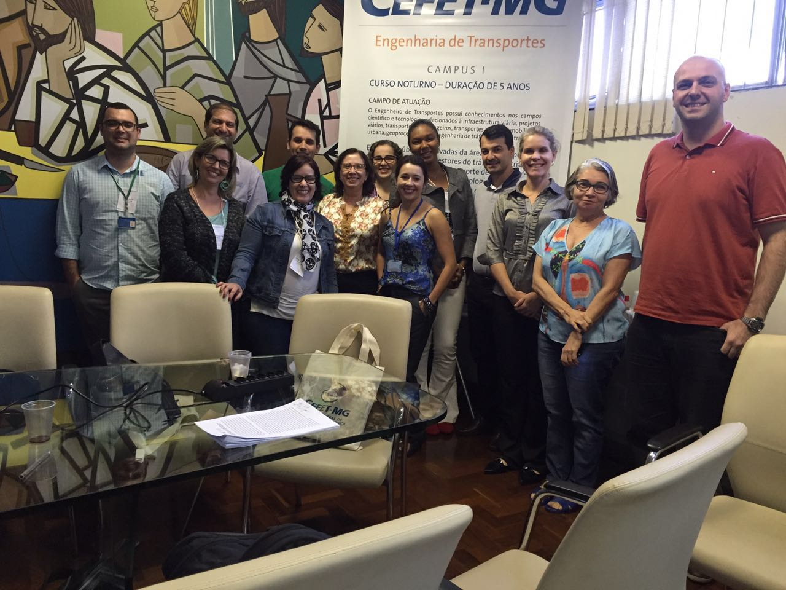
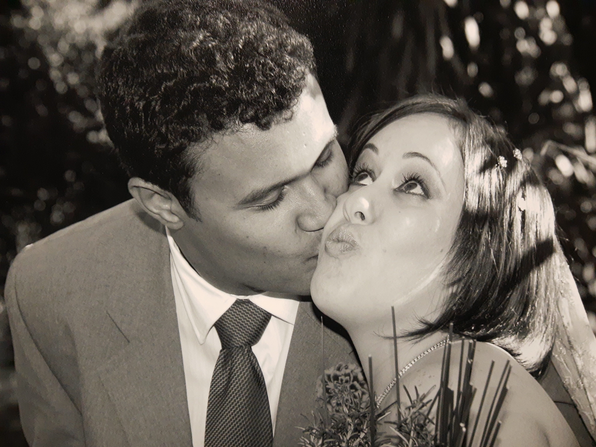
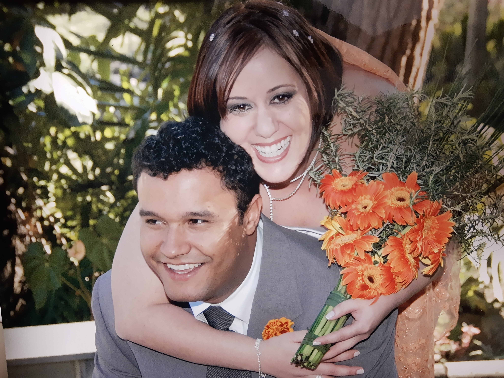
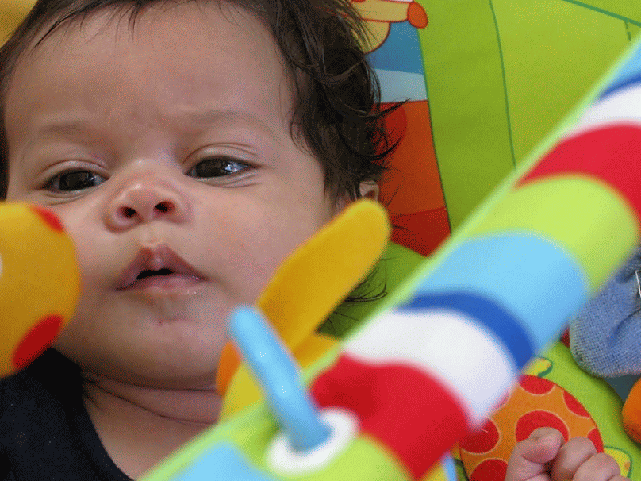
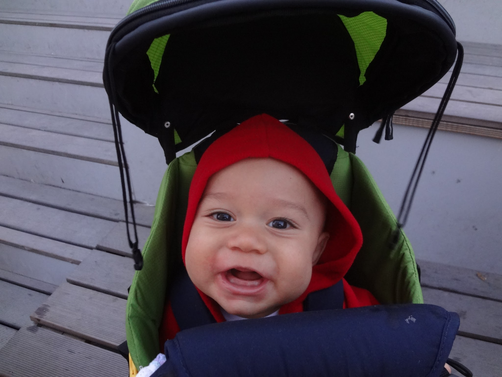
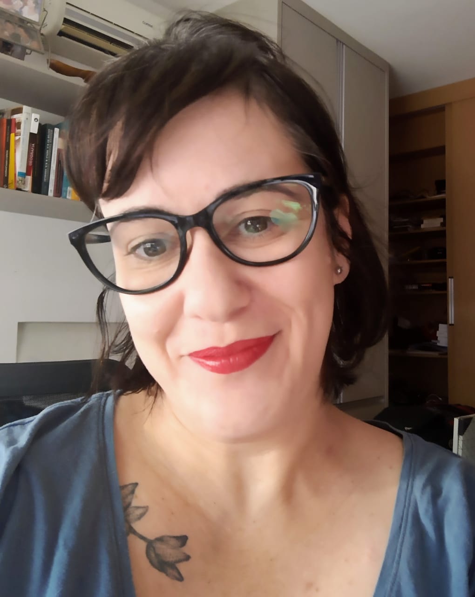

```{r child = "setup.Rmd"}
```

class: middle
background-image: url(img/imagem3.png)
background-size: contain

.huge[
.center[
Curating people and Reducing distances.... 
]]

.purple[
.bigger[
**Lecture for the position "Assistant Professor progressing the transition to future transport solutions"**
]]


.purple[
24/05/2022
]

---
background-image: url(img/joanna-kosinska-1_CMoFsPfso-unsplash.jpg)
background-size: cover

# Agenda

.large[
.bold[
.pull-right-wide[
Understanding the world...

Learning and teaching...

Producing and sharing knowlegde for a better world...

Why Chalmers and where to go...

]]]


---
class: center, middle
background-image: url(img/flower2.jpg)
background-size: cover

.huge[Understanding the world...]


---
class: center, middle
background-image: url(img/flower2.jpg)
background-size: cover

```{r time, echo=FALSE, fig.cap="", message=FALSE, warning=FALSE, out.width="95%"}
knitr::include_graphics("img/understand.png")
```

---
background-image: url(img/flower2.jpg)
background-size: cover

## That's 70s show

.pull-left[
```{r pais, echo=FALSE, out.width="90%"}
knitr::include_graphics("img/pais.jpg")
```  
]

.pull-right[
```{r reta-baby-1, echo=FALSE, fig.cap="", out.width="70%"}
knitr::include_graphics("img/gecy.jpg")
```
]

???

IMG_20210513_194541444

I was born in 1979, in Belo Horizonte, Brazil. 

---
background-image: url(img/flower2.jpg)
background-size: cover

## That's 70s show

```{r eu, echo=FALSE, out.width="60%"}
knitr::include_graphics("img/reta_baby_1.jpg")
```  

???

IMG_20210513_194541444

I was born in 1979, in Belo Horizonte, Brazil. 

---
class: middle, center
background-image: url(img/bh_pic.png)
background-size: cover

--

```{r bh, echo=FALSE, out.width="65%"}
knitr::include_graphics("img/bh.png")
```  


---
background-image: url(img/idaho.png)
background-size: cover


---
class: center, middle
background-image: url(img/change1.jpg)
background-size: cover

.huge[Learning and teaching...]


---
class: center, middle
background-image: url(img/change1.jpg)
background-size: cover

```{r time1, echo=FALSE, fig.cap="", message=FALSE, warning=FALSE, out.width="95%"}
knitr::include_graphics("img/understanding1.png")
```

---
background-image: url(img/thisisengineering-raeng-lSgfUoyyDwI-unsplash.jpg)
background-size: cover

.yellow[
.larger[
Civil Engineering and carreer choice
]]

.yellow[.bigger[
- Students council and institutional representation
- Undergrauduate Program for Scientific Training]]

.off-white[.bigger[
       - “Residential Mobility and Transportation System in the Metropolitan Region of Belo Horizonte” 
]]
.yellow[.bigger[
- Final semester: Transportation Engineering
]]
---

class: center
background-image: url(img/change1.jpg)
background-size: cover

```{r forma, echo=FALSE, out.width="100%"}
knitr::include_graphics("img/forma.png")
```  

---
class: center
background-image: url(img/change1.jpg)
background-size: cover


```{r forma1, echo=FALSE, out.width="100%"}
knitr::include_graphics("img/forma1.png")
``` 

---

background-image: url(img/change1].jpg)
background-size: cover

# Master degree


.large[
Military Institute of Engineering - M.Sc. Transportation Engineering

"Neuro-Fuzzy Model for Freight Transport Mode Choice"

Supervisor: Prof. Marcus Vinícius Quintela Cury
]

.center[
.larger[
2002-2004
]]

---
background-image: url(img/change1].jpg)
background-size: cover

# Postgraduate diploma in Railway Engineering


.large[
Vale - PgDip. Transportation Engineering
]

Analysis of the Increased Reliability of the Locomotives of the Grain Route after the Implementation of FCA's New Traction Frame

.center[
.larger[
2003-2004
]]


---
background-image: url(img/change1].jpg)
background-size: cover

# Teaching experience

.purple[
.larger[
English Teacher: 1996-2000
]]

```{r english, echo=FALSE, out.width="90%"}

``` 


New Horizons College    

Community Foundation for Higher Education of Itabira

Department of Transportation Engineering and Geotechnics - UFMG

Cefetmg

---

background-image: url(img/change1].jpg)
background-size: cover

# Professional experience in the industry

.pull-left[
.large[
.bold[
Systra - Tectran
]]]

--


.pull-left[
.large[
.bold[
Vale - Engenharia Ferroviária
]
]
]

---

background-image: url(img/change1].jpg)
background-size: cover

.pull-left-wide[
```{r vale, echo=FALSE, fig.cap="", out.width="100%"}
knitr::include_graphics("img/vale.png")
```
]

.pull-right-narrow[
- Estudos operacionais
- VPL
- PPC
]


---
background-image: url(img/cefet1.png)
background-size: cover

.center[
.larger[
2006 - 2019
]]

**Transportation Engineering Department**

Technical courses in Transportation and Traffic


Coordenação de laboratórios


Coordenação de cursos


Sub-coordination and coordination of Transportation Engineering undergraduate course   

Introduction to Transportation Engineering ❤️   

Scientific Initiation and Junior Scientific Initiation students

.pull-right[
```{r enge, echo=FALSE, fig.cap="Encontro Nacional dos coordenadores de cursos de graduação", message=FALSE, warning=FALSE, fig.align = 'center',out.width="100%"}

```
]

---
background-image: url(img/cefet1.png)


.bold[
.larger[
2020 - today   
Administração
]]


.bigger[
- Research Ethics Committee CEP/CEFET-MG;
--
- Thematic commitee for research projects assessment;
--
- Participation in Examining Boards for different positions in Technological Education career;
--
- Participation in Examining Boards of the simplified positions for temporary teachers;
--
- Other temporary commissions;
]

---

class: middle


❤️❤️


.pull-left[
```{r nos2, echo=FALSE,  message=FALSE, warning=FALSE, out.width="70%"}

```
]

❤️❤️
.pull-right[
```{r nos3, echo=FALSE,  message=FALSE, warning=FALSE, out.width="70%"}

```
]

---
class: middle


❤️❤️


.pull-left[
```{r sofia, echo=FALSE,  message=FALSE, warning=FALSE, out.width="70%"}

```
]
❤️❤️
.pull-right[
```{r sofia2, echo=FALSE,  message=FALSE, warning=FALSE, out.width="50%"}
knitr::include_graphics("img/sofia2.png")
```
]

---

class: middle

❤️❤️
.pull-left[
```{r joao, echo=FALSE, message=FALSE, warning=FALSE, out.width="70%"}

```
]

❤️❤️
.pull-right[
```{r joao2, echo=FALSE, message=FALSE, warning=FALSE, out.width="50%"}
knitr::include_graphics("img/joao2.png")
```
]

---
class: center, middle
background-image: url(img/butterfly.jpg)
background-size: cover

.huge[Producing and sharing knowlegde for a better world...]

---

class: center, middle
background-image: url(img/butterfly.jpg)
background-size: cover

```{r time2, echo=FALSE, fig.cap="", message=FALSE, warning=FALSE, out.width="95%"}
knitr::include_graphics("img/understanding2.png")
```

---

background-image: url(img/puc.png)
background-size: container

.larger[
2011-2015
]

.large[
Geography - Spatial Information Treatment   
]

*Alexandre Magno Alves Diniz*

.large[
Período sanduíche no Institut Rhônalpin des Systèmes Complexes   
]

*Prof. Pablo Jensen*

Spatial Analysis of the correlation among the location of grocery retailers, the average income of the population and prices policy: a case study for Belo Horizonte.

---


background-image: url(img/mps.jpg)
background-size: cover


.larger[
2015
]

.bold[
.large[
Análise Espacial dos Preços de Produtos Alimentícios no Varejo de Belo Horizonte e sua relação com a renda média da população   
Orientação: *Alexandre Magno Alves Diniz*

]]

.center[
.larger[
.pink[
Acessibilidade
]]]

---

# 2017 - 2021

.bold[
Programa de mestrado em Geotecnia e Transportes da UFMG   
]

.midi[
-   Clarissa Pontes Melo - Análise da macroacessibilidade de pedestres idosos sob a ótica da qualidade do espaço urbano. 2021.

-   André Augusto Cunha Libânio - Avaliação da acessibilidade em cidades brasileiras. 2020.

-   Paulo Henrique Góes Pinto - Identificação e qualificação de centralidades urbanas por meio de estrutura morfológico-funcional: um estudo de caso para a RMBH. 2020.

-   José Moreira Gonçalves - Atração de Viagens de Carga em Indústria Automobilística de Máquinas Agrícolas e Rodoviárias. 2019.

-   Gabriela Pereira Lopes - Uma Análise da Localização de Instalações Logísticas versus Geração de Viagens e os Impactos na mobilidade urbana em Belo Horizonte. 2018.
]

---


---


.pull-left[
.bold[
.larger[
2017...   
Pesquisa
]]

.bold[
.midi[
Translog City   

NIUMAR - Network on Intelligent Urban Mobility and Accessibility research ❤️   

PLACES - Planning for Access ❤️  

NOSS - Núcleo de Estudos Organizacionais e Sociedade e Subjetividade ❤️  
]]
]

.pull-right[
    ```{r niumar, echo=FALSE, fig.cap="2o Workshop da NIUMAR", out.width="100%"}
    knitr::include_graphics("img/niumar.jpg")
    ```
]

---

background-image: url(img/fundo2.png)
background-size: cover

```{r echo=FALSE, message=FALSE, warning=FALSE, out.width="90%"}
knitr::include_graphics("img/2022-05-06 22_30_58-Seal of Excellence.pdf - Foxit Reader.png")
```


.bold[
.larger[
Pesquisa
]]

.pull-left[
**Revisora**   
Transportes   
IEEE Access   
Sustainable Cities and Society   
Research in Transportation Economics   
Transportation Research Record   
Urban Rail Transit   
]

.pull-right[
**Corpo editorial**   
Caderno de geografia   
Revista Brasileira de Transportes.   
]

---

.pull-left[
.bold[
.larger[
2018 ...    
Extensão
]]

.bold[
.midi[

Horta da Cidade   

Plano de mobilidade de Paraíso do Tocantins   

I Fórum Brasileiro de Logística Urbana   

PET - Adm ❤️
]
]]

.pull-right[

```{r horta, echo=FALSE, fig.cap="Evento no Sebrae - Horta da Cidade", out.width="100%"}
knitr::include_graphics("img/horta.jpg")
```
]


---

# 2020 ...


.bold[
Programa de mestrado Administração do CEFET-MG
]

*Processos e sistemas decisórios em arranjos organizacionais*

-  Sofia Eleutério - trabalho sobre o processo decisório quanto à implementação de faixas exclusivas de ônibus como política pública.
- Felipe - caracterização da atividade e políticas públicas para vendedores ambulantes em BH   
- Fernando - Redes sociais para analisar a relação entre filiação partidária e cargos comissionados no governo federal

Colegiado do PPGA


---

background-image: url(img/cefet1.png)

.bold[
.larger[
2020 ...
]
Departamento de Ciências Sociais Aplicadas
]

*Novas disciplinas*   
*Novas perspectivas*   
*Novas parcerias*

Colegiado de Administração

---

.bold[
.larger[
2018 ...    
Internacionalização
]]

.midi[
4th VREF Conference. Relationships among urban characteristics, real estate market and spatial patterns of warehouses in different geographic contexts. 2021.

11th International Conference on City Logistics. EXPLORATORY ANALYSIS OF THE ACCESSIBILITY TO FOOD RETAILERS IN BELO HORIZONTE. 2019. 

15th biannual NECTAR Conference. ACCESSIBILITY TO FOOD SYSTEMS IN BELO HORIZONTE, BRAZIL. 2019. ❤️

6th workshop NIUMAR. Projects under development and research agenda. 2019. ❤️
]

---

.bold[
.larger[
2018 ...    
Internacionalização
]]

.midi[

1st Brazilian EMI. 2018.

3rd workshop NIUMAR. Perspectivas de parceria. 2018. ❤️

4th workshop NIUMAR. Encaminhamentos. 2018. ❤️

Workshop do Cluster 2 do Nectar. A sustainable business model for urban farming based on city logistics concepts for local production and consumption of vegetables. 2018. ❤️


]

---


.bold[
.larger[
2018 ...    
Internacionalização
]]

.midi[
Efficiency in Urban Logistics: Current challenges, innovative & green solutions. 2017.

Researchers Links Workshop: How the Railways contribute to improving quality of life?. Researchers Links Workshop. 2017. ❤️

2nd workshop da NIUMAR. Desenvolvimento de pesquisa. 2018. (Seminário). ❤️

Semana Internacional de Engenharia Metroferroviária, Transportes e Logística. Análise espacial aplicada a soluções para o último quilômetro. 2017.


]

---
.bold[
.larger[
2018 ...    
Internacionalização
]]

.midi[


Tenth International Conference on City Logistics. Urban Distribution of Craft-Brewed Beer in Belo Horizonte Metropolitan Area. 2017.

Cyprien Legros   
Jonathan Reith   
Joanna Wilkolek   
Neda Marjanovic   
]

---

.bold[
.larger[
2020 - 2021    
Pós-doutorado remoto
]]

.bold[
.large[
Relationships among urban characteristics, real estate market and spatial patterns of warehouses in different geographic contexts.
]]

Logistics City Chair, da Université Gustave Eiffel   
*Laetitia Dablanc*  


---
class: center
background-image: url(img/future.jpg)
background-size: cover


# E o futuro?


---

---
class: center, middle
background-image: url(img/flower2.jpg)
background-size: cover

.huge[Why Chalmers and where to go...]


---

.bold[
.large[
Reduce distance among faculty and students

Teaching and learning - being a tutor - teaching to learn
]]

--

.bold[
.large[
Critical perspective even in the most positivist disciplines
]]

--

.bold[
.large[
Fun - gamification and student protagonism
]]

--

.bold[
.large[
Adaptation - Emergency Remote Learning
]]

--

.bold[
.large[
Study, study, study, and study some more!
]]

--

.bold[
.large[
Contribute to building better places to live, human scale cities and social justice - And this is what drives Chalmers
]]

--

.bold[
.large[
Communicating Science - OpenScience
]]

---
How


---
What


---

class: center
background-image: url(img/passion.jpg)
background-size: cover

.bold[
.large[
“To TEACH, one needs Eros” Plato

To LEARN, one needs Eros. Renata

To produce KNOWLEDGE, one needs Eros. Renata
]]

---

class: middle, center
background-image: url(img/together.jpg)
background-size: cover

---

class: bottom, center
background-image: url(img/dist.jpg)
background-size: cover

.larger[
Curating people and reducing distances....
]
---

class: inverse

.link_style[
.pull-left[

[Lattes](http://lattes.cnpq.br/2642488704355833)

[Orcid](https://orcid.org/0000-0002-9011-2342)

[Google Scholar](https://scholar.google.com/citations?user=V6EX45EAAAAJ)

[CV](https://github.com/retaoliveira/relements/raw/main/texto/index.pdf)

]]

.pull-right[

```{r , echo=FALSE,message=FALSE, warning=FALSE, out.width="40%"}

```

```{r , echo=FALSE,message=FALSE, warning=FALSE, out.width="40%"}

```
]

---


class: bottom, center
background-image: url(img/wordcloud.png)
background-size: cover

.larger[
.pink[
**Muito obrigada**!
]]

---

```{r eval=FALSE, include=FALSE}
library(ggwordcloud)
#> Loading required package: ggplot2
data("love_words_small")
set.seed(42)
ggplot(love_words_small, aes(label = word, size = speakers)) +
  geom_text_wordcloud() +
  scale_size_area(max_size = 40) +
  theme_minimal()
```

