```{r child = "setup.Rmd"}
```

class: middle
background-image: url(img/imagem3.png)
background-size: contain


.enormous[
Increasing and reducing distances.... 
]


.bigger[
.purple[
Lecture for the position "Assistant Professor progressing the transition to future transport solutions
]]


.purple[
24/05/2022
]

???

You have my resume and all information you need to understand the my technical career. I prepared this presentation to let you know who I am, how my previous experiences as an engineer, teacher and researcher has shaped me and my expectations of opportunities in Chalmers and how can I contribute to Chalmers.   

---
class: inverse

# Agenda

--

.large[
Understanding the world...
]

--
.large[
Learning and teaching...
]

--
.large[
Producing and sharing knowledge for a better world...
]

--
.large[
Why Chalmers and where to go...
]

???

I have structured my presentation in four chronological sections! 

Understanding the world...

Learning and teaching...

Producing and sharing knowlegde for a better world...

Why Chalmers and where to go...

---

class: center
background-image: url(img/flower2.jpg)
background-size: cover

.enormous[
Understanding the world...
]

???

The first 18 years of my life

---

class: center, middle

```{r time, echo=FALSE, fig.cap="", message=FALSE, warning=FALSE, out.width="95%"}
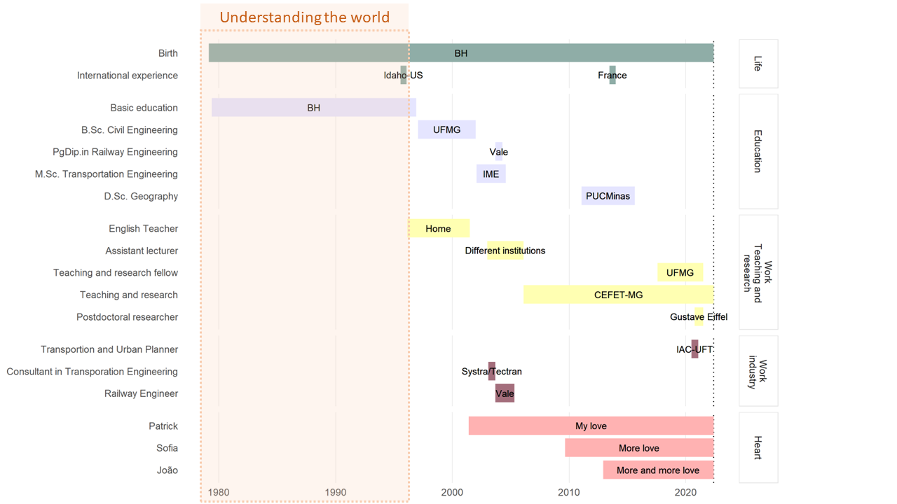
```

???

The first stage of my life was an inductive exploration of the world! 

---

## Origins

.pull-left[
```{r pais, echo=FALSE, out.width="90%"}
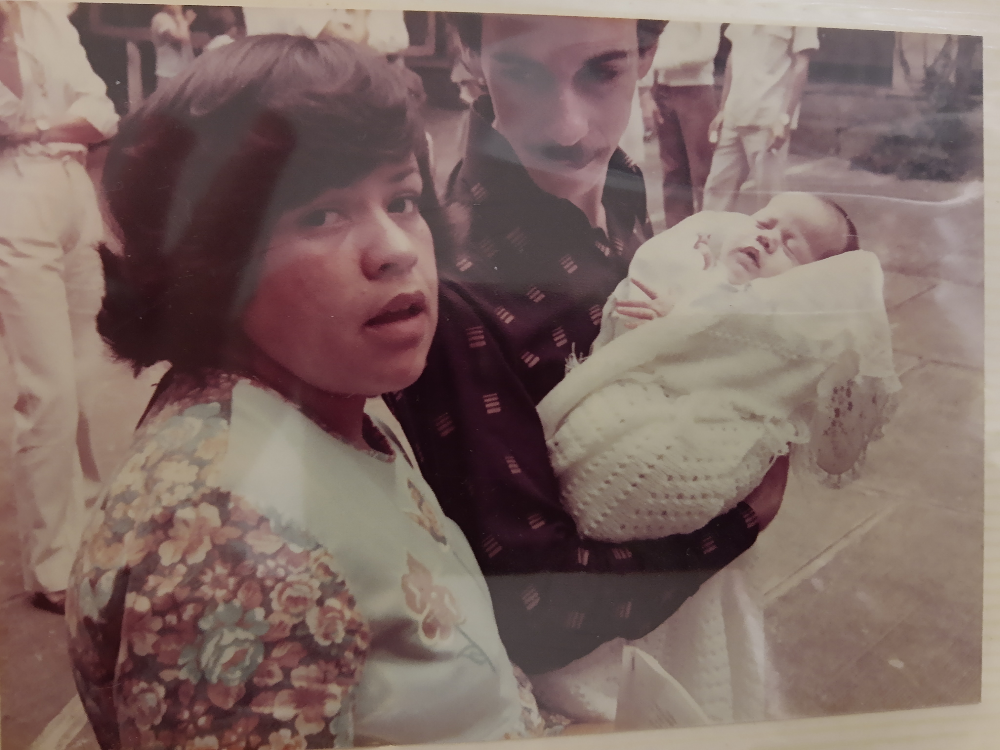
```  
]

.pull-right[
```{r reta-baby-1, echo=FALSE, fig.cap="", out.width="60%"}
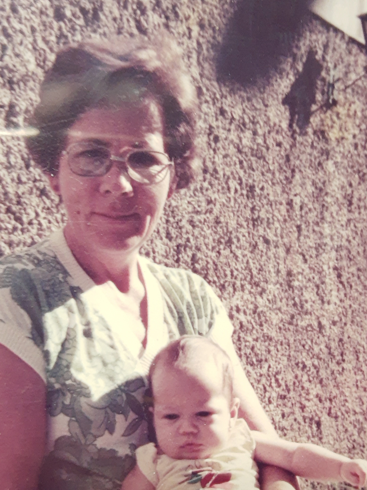
```
]

???

I was born in a traditional, medium-class Brazilian family, back in 1979. Besides my parents, who look like they have just come out of a TV series from the 80's, my grandmother played an important party in this first stage of my life. 

---

## The cutest version of me ❤️
 
```{r eu, echo=FALSE, out.width="55%"}
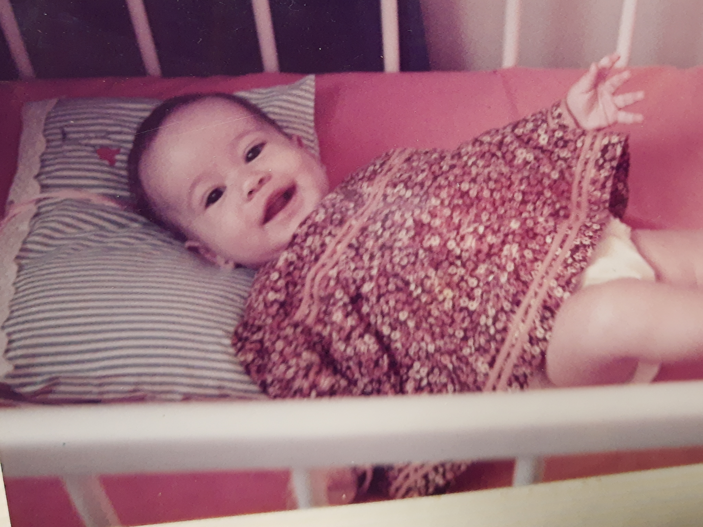
```  


---
class: middle, center
background-image: url(img/bh_pic.png)
background-size: cover

???

I was born in Belo Horizonte, this big, young and inequitable, metropolitan area in the southeast of Brazil. As other cities and metropolises in Brazil, it has car-oriented planners, very little public transport and street design that does not allow pedestrians and bicycles to get around safely. In addition to all that, lots of inequalities, poverty and security issues. 

--

```{r bh, echo=FALSE, out.width="65%"}
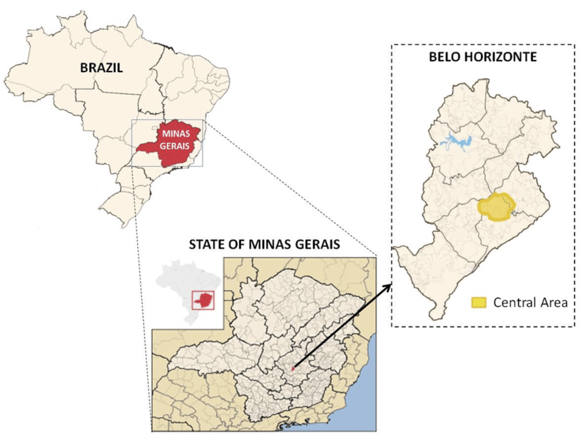
```  

???


For those of you that do not know where Belo Horizonte is, here is a little hint! 


---
background-image: url(img/snow.jpeg)
background-size: contain

???

I had a traditional adolescence, going crazy at the first time I played in the snow! This happened in my first international experience: a high school exchange program in Idaho-US.

My ecumene kept enlarging!

---

background-image: url(img/young.png)
background-size: cover

## Renata by late 90s


---

background-image: url(img/change1.jpg)
background-size: cover

.enormous[
Learning and teaching...
]

???

The second part I proposed for this presentation concerns the more deductive part of my life. Less exploration, more acquisition of knowledge, and mostly I found myself entrapped in an unequal and hypothetical world.

Another 15 years of my life.

---
class: center, middle


```{r time1, echo=FALSE, fig.cap="", message=FALSE, warning=FALSE, out.width="95%"}
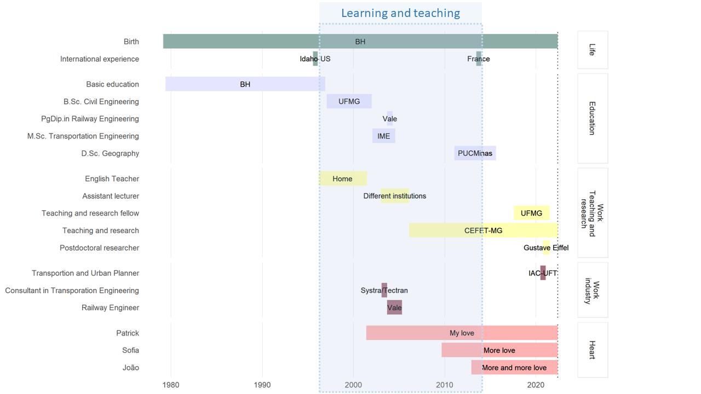
```

???

These were times to get a Bachelor's and Master's degree, a Postgraduation diploma, some professional experience and a lot of teaching experience! And a lot of LOVE! I kept expanding my ecumene and enhancing distances from the real tangible world (besides motherhood! what a well-grounded challenge!)

---


## Civil Engineering 🢁 🌎 🚷

.pull-left[
.bigger[
- Students council and institutional representation
- Undergrauduate Program for Scientific Initiation: **Residential Mobility and Transportation System in the Metropolitan Region of Belo Horizonte** 
- Final semester: **Transportation Engineering**
]]

.pull-right[
```{r civil1, echo=FALSE, fig.cap="", message=FALSE, warning=FALSE, out.width="80%"}
knitr::include_graphics("img/pexels-thirdman-5584052.jpg")
```
]

???

During my undergraduate studies, I explored possibilities that were a game changer in my professional journey. 

I was a member of the students council and responsible for institutional representation of s students body

I joined an Undergrauduate Program for Scientific Initiation in the project entitled “Residential Mobility and Transportation System in the Metropolitan Region of Belo Horizonte”.

And in my final semester, I enrolled myself in transportation engineering courses. 

Transportation was the only field of knowledge in my course that allowed me to identify challenges directly related to people. 

---
class: center

```{r forma1, echo=FALSE, out.width="100%"}
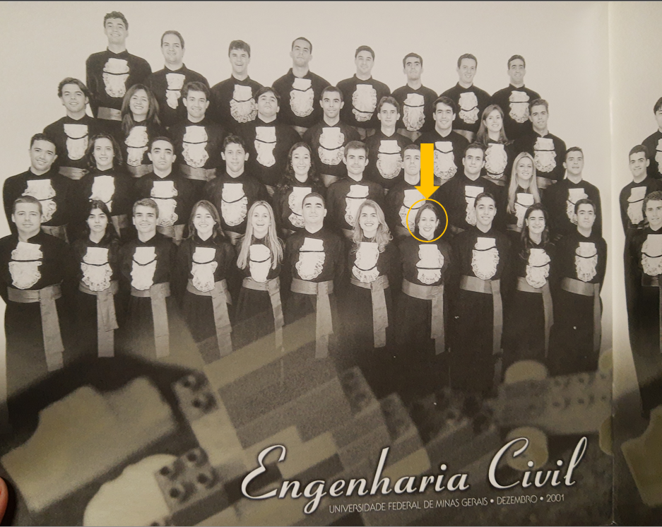
``` 


???

By the end of 2001, I got my Civil Engineering Bachelors' degree. But.... 


---

## M.Sc. Transportation Engineering 🢁 🌎 🚷

.pull-left[
```{r ime, echo=FALSE, out.width="100%"}
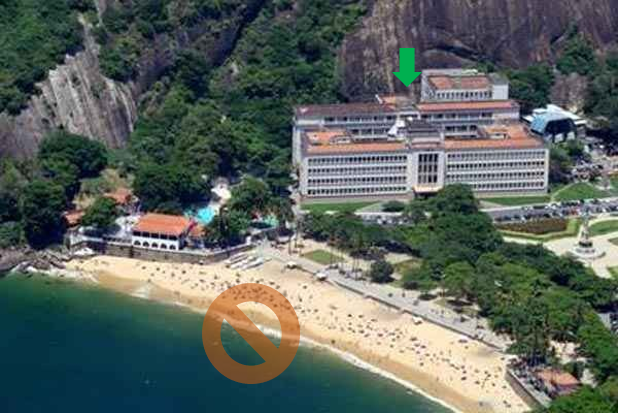

```
]

.pull-right[
.bigger[
- Military Institute of Engineering

- **Neuro-Fuzzy Model for Freight Transport Mode Choice**

- Supervisor: Prof. Marcus Vinícius Quintela Cury
]]

???
I wasn't sure I was well instructed to work as an transportation engineer. So I decided to get a master's degree. Once more, my ecumene expanded to Rio de Janeiro! But, since I had been working since I was 16 years-old, I decided to go back to Belo Horizonte and work while finishing the thesis. In the mean time.... 

---

## Pg. diploma in Railway Engineering 🢁 🌎 🚷

.pull-left[
.bigger[
Vale - PgDip. Transportation Engineering

**Analysis of the Increased Reliability of the Locomotives of the Grain Route after the Implementation of FCA's New Traction Scheme**
]]

.pull-right[
```{r vale, echo=FALSE, out.width="100%"}
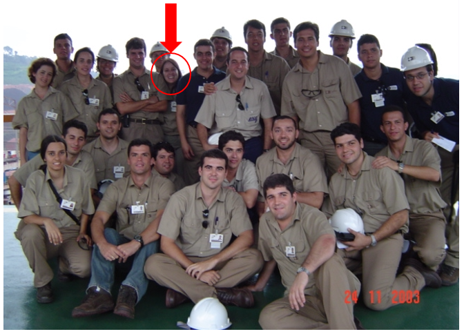
```
]

???

I had the opportunity to get a postgraduate diploma at Vale in Railway Engineering and in 2004 I defended my thesis. 

---

## Professional experience 🢁 🌎 🚷

.pull-left[
```{r vale1, echo=FALSE, out.width="80%"}
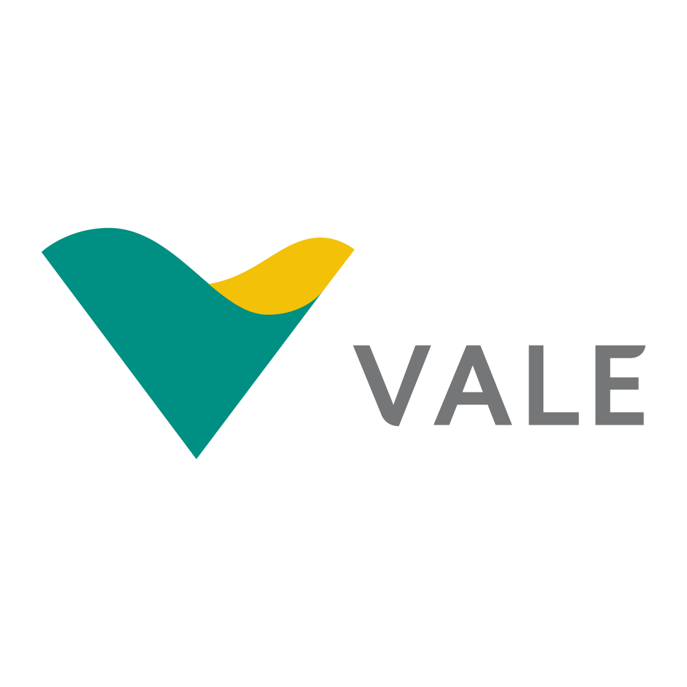
```
]

.pull-right[
```{r systra, echo=FALSE, out.width="60%"}

```
]


---

background-image: url(img/fundo.png)
background-size: cover

## Sparkling the joy of learning since 1996*** .center[🢃 🚶 🚴 🔗]
.footnote[*** OR TRYING REALLY HARD `r emo::ji("teacher")`]

.bigger[
English Teacher

Novos Horizontes College    

Community Foundation for Higher Education of Itabira - FUNCESI

Department of Transportation Engineering and Geotechnics - UFMG

**Federal Center for Technological Education of Minas Gerais**
]

???

Teaching is not an activity characterized by a chronological time frame. Since I started teaching, I felt that the interaction with students was extremely joyful. This activity brought me closer to people. 

Along with my studies, I experimented teaching... English teacher, lecturer in different institution.

---

## CEFET-MG 🢃 🚶🚴🔗

.bigger[.center[.purple[.bold[
Transportation Engineering Department <br> Department of Applied Social Sciences
]]]]

.bigger[
.pull-left[
**Academic coordinator** of **Transportation Engineering** undergraduate course   

**Undergraduate** and **graduate** students

**Research Ethics** Committee   
]

.pull-right[
Thematic commitee for **research projects assessment**

**Examining Boards** for different positions in Technological Education career

**Examining Boards** of the simplified positions for temporary teachers

]]

---

class: center, bottom
background-image: url(img/games.png)
background-size: cover

---

background-image: url(img/adult.png)
background-size: cover

## Renata by early 2010s

---

class: center, bottom
background-image: url(img/pexels-pixabay-63643.jpg)
background-size: cover

.enormous[
Producing and sharing knowledge for a better world...
]

???

The last ten years of my career
Finally reducing distances! Focusing on people, social justice and human scale cities...


---

```{r time2, echo=FALSE, fig.cap="", message=FALSE, warning=FALSE, out.width="95%"}
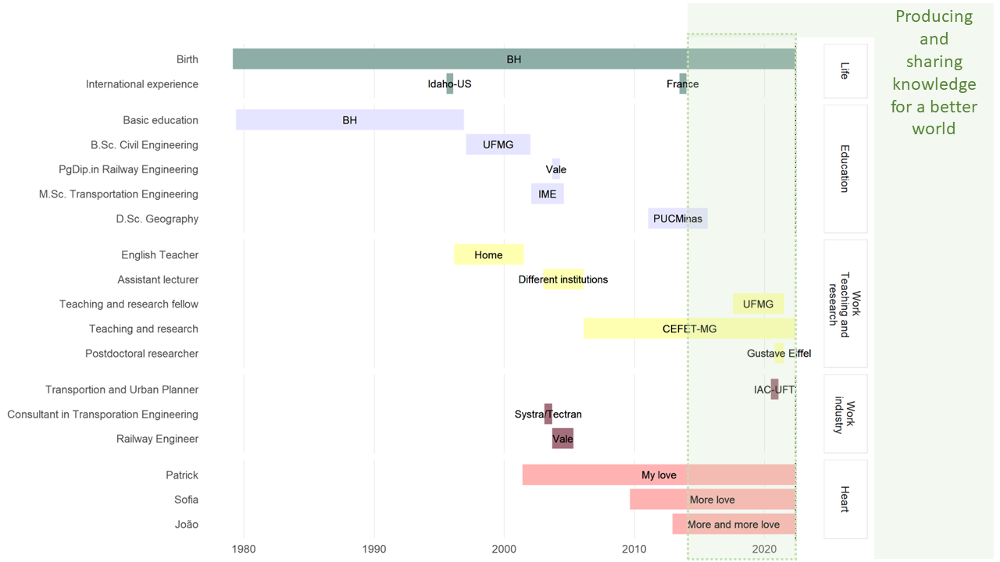
```

---

## Doctor's degree in Geography - Spatial Analysis .center[🢃🚶🚴🔗]

.pull-left[
.bigger[
**Spatial Analysis of the correlation among the location of grocery retailers, the average income of the population and prices policy: a case study for Belo Horizonte**
]

*Supervisor: Alexandre Magno Alves Diniz*

PUCMinas   
Institut Rhônalpin des Systèmes Complexes   
]

.pull-right[
```{r doc, echo=FALSE, fig.cap="", message=FALSE, warning=FALSE, out.width="95%"}
knitr::include_graphics("img/defesa.JPG")
```
]

---

## Research in collaboration 🢃🚶🚴🔗

.bigger[
.pull-left[

Network on Intelligent Urban Mobility and Accessibility research ❤️   

RedeTP@acesso ❤️

Center for Organizational Studies, Society and Subjectivity ❤️  
    
**PLACES - Planning for Access** ❤️  

IST - Lisbon University

]]

.pull-right[
.bigger[
Aston University

Federal University of Minas Gerais   

Federal University of Tocantins   

Federal University of São Carlos

Federal University of Ceará  

Université Gustave Eiffel
]]

---

## Community involvement 🢃🚶🚴🔗

.pull-left[
.bigger[
Horta da Cidade - social enterpreneurship ❤️

Paraíso do Tocantins Mobility Plan ❤️  

Tutorial Education Program ❤️

Technical advisory council for metropolitan planning ❤️
]]
.pull-right[
```{r horta, echo=FALSE, out.width="100%"}
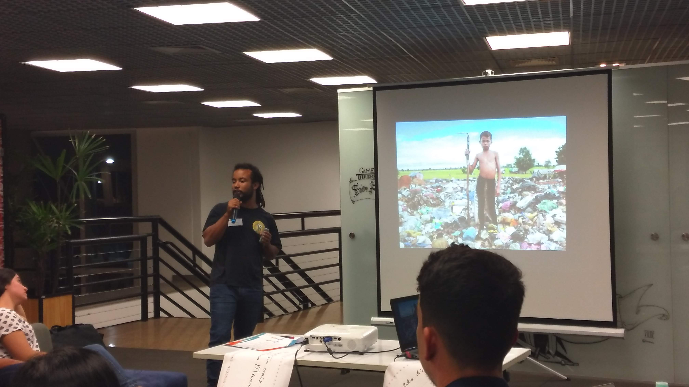
```
]

---

## Postdoctoral Fellowship 🢃🚶🚴🔗

.bigger[
**Relationships among urban characteristics, real estate market and spatial patterns of warehouses in different geographic contexts**


Logistics City Chair, da Université Gustave Eiffel   
*Supervisor: Laetitia Dablanc*  
]


---

## External Funding 🢃🚶🚴🔗

.pull-left[
.bigger[
**RENOVATE - Freight transport webGIS tools for livable cities**

MSCA Postdoctoral Fellowship 2021
]]

.pull-right[
```{r echo=FALSE, message=FALSE, warning=FALSE, out.width="55%"}
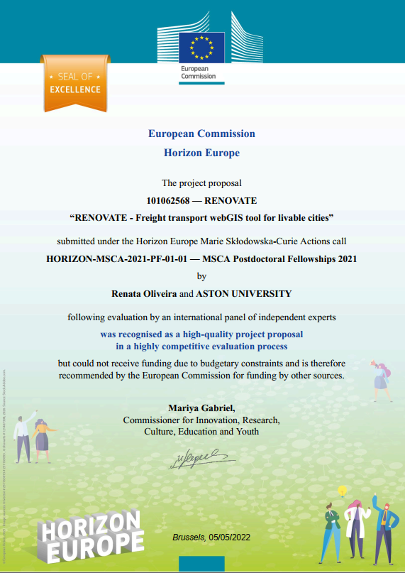
```
]

---

## External Funding 🢃🚶🚴🔗

.pull-left[
.bigger[
**Individual research grant - productive researcher**   
]
National Council for Scientific and Technological Research
Grant number: 314045/2021-0
2022-2025

.bigger[
**Individual research grant - productive researcher**
]
National Council for Scientific and Technological Research
Grant number: 312750/2018-8
2019-2022
]

.pull-right[
.bigger[
**Universal research resources**
]
National Council for Scientific and Technological Research
Grant number: 404754/2021-0
]

---

## Main research efforts 🢃🚶🚴🔗

.bigger[
.pull-left[
**Accessibility-oriented planning**   
- Reducing inequalities through accessibility and mobility planning in the sustainable urbe

**Railroads and Economic Development**
]

.pull-right[
**Urban Logistics**   
- Urban agriculture  
- Analysis of the spatial structure of logistics facilities and its relationship with urban attributes   
- Freight Travel Generation Models for Brazilian Cities   
- Urban freight distribution in Brazilian historic cities
]]

---

## Teaching Philosophy (🚧) 🢃🚶🚴🔗

.pull-left[
.bigger[

**Reduce distance** among faculty and students

Students must be **active parties** in education and use the self 

**Fun** - gamification and student protagonism

**Learn by making** and project/problem oriented learning
]]

.pull-right[
.bigger[
 Engage students in **Lifelong learning**

**Critical** perspective and understanding the **social roles** students play in building and exploring the world

**Social-transformative education**
]]

???

## Social-transformative education 
Those truly committed to liberation must (…) abandon the educational goal of deposit-making and replace it with the posing of problems of human beings in their relations with the world. “Problem-posing” education, responding to the essence of consciousness – intentionality – rejects communiqués and embodies communication. (Freire, 1968/2000, p. 79).

Social transformative education asks for a different positioning of students, teachers and societal partners such that one does not dominate or impose upon the other, but that they jointly learn about and change the conditions of society.

As a group students will propose a social challenge they want to address. As a group, including teachers and societal partners, they will formulate their research problem in a way that challenges their student-centric view and opens up their minds to alternative perspectives. Within this educational setting, all parties participate as researchers – Freire called this the collaboration between the teacher-students and the student-teachers.

Together they look into the social challenges and redefine the challenges as well as their solutions. This form of education is not only about ‘what is’, with all the subjectivity that this implies, but also about ‘what could be’, squarely opposed to the false neutrality of the ‘banking’ mode of education imposed from the teacher to the individual student.

- social-transformative education Teacher suggesting confronting ideas that force the students to consider new information in a holistic, interdisciplinary manner helps to articulate the student’s worldview into a broader picture

resisted by education managers, ministries of education and many teachers until either the approach is watered down such that the projects are no longer problem-oriented or dropped altogether

emancipating and promoting the autonomy and protagonism
of people, preferably from the most vulnerable classes, through the Pedagogy of Autonomy
and liberating education.

to free oneself from the
heteronomies imposed by the constituted powers, characterized by selective, oppressive and
excluding political and economic systems, in order to become a subject, with time and voice,
author of his thinking and acting in the world.


---
background-image: url(img/today.png)
background-size: cover

## Renata - version 2022


---
class: center, bottom
background-image: url(img/arun-clarke-VAxzTA5IStU-unsplash.jpg)
background-size: cover


.enormous[
Why Chalmers and where to go...
]


---

## Why Chalmers? 🢃 👩 🏫 🎓 🕵 🔗

.bigger[
- **Innovative projects** for **knowledge production** to contribute for a **more sustainable, happy and equitable world**
]

--

.bigger[
- **Research structure** and **opportunities for funding** (Areas of advance, EC)
]

--

.bigger[
- Focus on **gender equity** and **diversity**]

--

.bigger[
- Implement **active learning** strategies, **fieldwork**, **problem/project based learning**, **EMI**, and other resources to **engage students** and create **synergy** between **research and education**
]

---

## Why Chalmers? 🢃 👩 🏫 🎓 🕵 🔗

.bigger[
- Opportunities for collaboration with **companies**, **policy-makers** and **society** (**Living Labs**)
]

--

.bigger[
- Possibility to build a **multidisciplinary** research to structure a **broad research approach** coordinating different departments in the Transport Area of Advance.   

Among many other expected opportunities....
]


???

My expectations: 

---
background-image: url(img/research_goals.png)
background-size: cover

???

This is not a research framework, but a structure that unfolds the ultimate goal into dimensions for proposing research questions and the theories and methods that can help explore methodological approaches in scientific investigation in the Transport Area of Advance  and in collaboration among related Departments. 

---

## Expected internal collaboration at Chalmers .center[🢃 👩 🢃 🏫 🢃 🎓 🢃 🔗]

Department | Collaboration
-----------|--------------
Architecture and Civil Engineering | Urban Design and Planning, Urban ans Regional Transformations, Cities and Complexity, Urban Functional and Morphological structures, Geocomputation 
Technology Management and Economics | Operations and Supply Chain Management, Entrepreneuship and informal labour, inequality measures, urban accessibility as the aim of urban planning and public policy
Computer Science and Engineering | Data Analytics, Geocomputation, Theoretical ML research for decision-making, natural language processing to support qualitative methods
Communication and Learning in Science | Support on research communication to broader audiences, data curation and compliance with GDPR and Open Science efforts. 
Space Earth and Environment (SEE) | Behaviour, energy, emissions, travel demand, travel behaviour, modelling and simulation.


---

## Why me? 

.bigger[
- I'm committed to contribute for building **better and sustainable places to live**, **human-scale cities** and **social justice**
]

--

.bigger[
- I have a **peculiar perspective** of **urban mobility and accessibility problems**. I see the world as a white woman, housewife, mom, citizen of the global south, who aims for **diversity and inclusion**. I have developed **critical thinking** about **city-related problems** regarding **transport technology** and **mobility systems** throughout my career
]

.bigger[
- **I ❤️ teaching** and have the ambition to explore deeper approaches to **engage students** into learning
]


---

## Why me? 

.bigger[
- I have **multidisciplinary** education and professional experience. This can be a great asset for Chalmers to address current **societal and corporate challenges** and coordinate internal and external **collaboration**
]

--
.bigger[
- I am passionate about **learning** and want to develop **strong teaching and research skills**
]

--

.bigger[
- I need to **work collaboratively** to have fun! Also, I have some experience in applying for **research funding** in the **Brazilian** and **European** contexts
]

.bigger[
- I'm eager to **communicate science** and develop projects aligned with **Open Science principles**!
]

???


At the beginning of my career I believed that Transportation Technology and Mobility Systems were the final objective of my professional activity, as an engineer, as a teacher and as a researcher. I believes that professional success would be achieved through corporate (mostly financial) results. I thought I could change the World (even if I tried by myself). 

Along the way, I became more humble; undestood that I could not change the world, specially alone; and that success and self-accomplishment are results of interactions, are result of connections and from exchange. My place in the world became much more responsible, fun and diverse. Today, my goal in the world is to interact with people and for people, as a teacher and as a researcher. I want to build connections and not bridges. 

Consolidate PLACES research group + Interaction among departments. 

---

class: center
background-image: url(img/pexels-monstera-5874738.jpg)
background-size: cover

.bold[
.large[
**“To TEACH, one needs Eros” Plato**

**To LEARN, one needs Eros. Renata**

**To produce KNOWLEDGE, one needs Eros. Renata**
]]

---

class: top, center
background-image: url(img/dist.jpg)
background-size: cover

.larger[
.center[
Keep reducing distances and expanding interactions for a better world! <br>
<br>
<br>
 👩 ➕ 🏫 ➕🎓 ➕ 🕵 ➕🌎
]]
---

class: middle, inverse

.pull-left[
```{r echo=FALSE, message=FALSE, warning=FALSE, out.width="55%"}
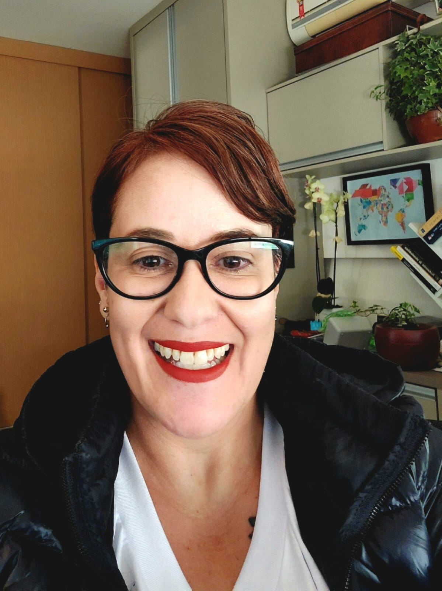
```
]


.pull-right[
.larger[
.center[
THANK YOU!
]]
]

<hr />

&nbsp;

<p style="text-align: center;"><span style="color: #ebdb00;"><em>renataoliveira@gmail.com</em></span></p>

<!-- Add icon library -->
<link rel="stylesheet" href="https://cdnjs.cloudflare.com/ajax/libs/font-awesome/4.7.0/css/font-awesome.min.css">

<link rel="stylesheet" href="https://cdn.jsdelivr.net/gh/jpswalsh/academicons@1/css/academicons.min.css">


<!-- Add font awesome icons -->
<p style="text-align: center;">
    <a href="https://twitter.com/retaoliveira?lang=en" class="fa fa-twitter fa-2x"></a>&nbsp;&nbsp;
    <a href="https://github.com/retaoliveira" class="fa fa-github fa-2x"></a>&nbsp;&nbsp;
    <a href="https://scholar.google.com/citations?user=V6EX45EAAAAJ" class="ai ai-google-scholar ai-2x"></a>&nbsp;&nbsp;
    <a href="https://orcid.org/0000-0002-9011-2342" class="ai ai-orcid ai-2x"></a>&nbsp;&nbsp;
    <a href="http://lattes.cnpq.br/2642488704355833" class="ai ai-lattes ai-2x"></a>&nbsp;&nbsp;
    <a href="https://github.com/retaoliveira/relements/raw/main/texto/index.pdf" class="ai ai-cv ai-2x"></a>

</p>

&nbsp;

---


## Some publications 🢃🚶🚴

.bigger[
**Access to urban activities** during COVID-19 pandemic and impacts on urban mobility: the Brazilian Context - .purple[Transport Policy]

The **geography of warehouses** in the SPMR and contribuiting factors to this spatial distribution - .purple[Journal of Transport Geography]

A **sustainable** approach for urban farming based on city logistics concepts for **local production and consumption** of vegetables - .purple[Research in Transportation Economics]

Analysis of the potential **demand** of **automated delivery stations** for e-commerce deliveries in Belo Horizonte, Brazil - .purple[Research in Transportation Economics]]

---
## Prizes

Paraninfa of the 72nd graduation seminar of industrial technicians - Graduates of the Technical Course in Transportation and Traffic, CEFET-MG.

Paraninfa of the 69th graduation seminar of industrial technicians - Graduates of the Technical Course in Transportation and Traffic, CEFET-MG.

Honored Professor of the Graduating Students in Civil Production Engineering, CEFET-MG.

President of the 67th graduation seminar of industrial technicians - Graduates of the Technical Course of Transport and Traffic, CEFET-MG.

In honor of the 66th graduation seminar of industrial technicians - Graduates of the technical course of Transport and Traffic, CEFET-MG.

Paraninfa of the 65 graduation seminar of industrial technicians - Graduates of the technical course of Transportation and Traffic, CEFET-MG.

Homage from the Administration class - Graduates of 2007, Fundação Comunitária de Ensino Superior de Itabira - FUNCESI.

Award for orienting the Best Monograph in the Administration course at FUNCESI, Fundação Comunitária de Ensino Superior de Itabira - FUNCESI.

Honored Professor of the Administration course, Faculdade Novos Horizontes.

---

# Couses ministede


---

# Students


???

Research presentation, 30 minutes on the theme: Please
 introduce yourself and your research and teaching experience related to the 
Area of Transport.

The lecture should cover: 


- Your previous and proposed research 


- How your research complements the existing research areas in relevant


1.
4th VREF Conference. Relationships among urban characteristics, real estate market and spatial patterns of warehouses in different geographic contexts. 2021. (Congresso).

2.
34 ANPET. Palestra Setorial: Mobilidade urbana, equidade e acesso a oportunidades durante e pós pandemia no Brasil. 2020. (Congresso).

3.
11th International Conference on City Logistics. EXPLORATORY ANALYSIS OF THE ACCESSIBILITY TO FOOD RETAILERS IN BELO HORIZONTE. 2019. (Congresso).

4.
15th biannual NECTAR Conference. ACCESSIBILITY TO FOOD SYSTEMS IN BELO HORIZONTE, BRAZIL. 2019. (Congresso).

5.
6th workshop NIUMAR.Projects under development and research agenda. 2019. (Seminário).

6.
1st Brazilian EMI. 2018. (Seminário).

7.
2nd workshop da NIUMAR.Desenvolvimento de pesquisa. 2018. (Seminário).

8.
3rd workshop NIUMAR.Perspectivas de parceria. 2018. (Seminário).

9.
4th workshop NIUMAR.Encaminhamentos. 2018. (Seminário).

10.
SECIPET.As interações urbanas e a distribuição de mercadorias. 2018. (Seminário).

11.
Workshop do Cluster 2 do Nectar.A sustainable business model for urban farming based on city logistics concepts for local production and consumption of vegetables. 2018. (Seminário).

12.
2o Workshop de Inteligência Geográfica Aplicada ao Planejamento de Transportes.Análise espacial a soluções para o último quilômetro. 2017. (Seminário).

13.
Congresso Nacional de Engenharias de Mobilidade. Análise Espacial Aplicada ao Planejamento da Distribuição Urbana de Mercadorias. 2017. (Congresso).

14.
Efficiency in Urban Logistics: Current challenges, innovative & green solutions. 2017. (Seminário).

15.
I SEMINÁRIO CIENTIFICO DE PESQUISA EM TRANSPORTE "FUTURO NO TRANSPORTE DE BELO HORIZONTE". 2017. (Seminário).

16.
Researchers Links Workshop: How the Railways contribute to improving quality of life?.Researchers Links Workshop. 2017. (Seminário).

17.
Semana de Engenharia da UNA.Análise Espacial Aplicada ao Planejamento da Distribuição Urbana de Mercadorias. 2017. (Seminário).

18.
Semana Internacional de Engenharia Metroferroviária, Transportes e Logística.Análise espacial aplicada a soluções para o último quilômetro. 2017. (Seminário).

19.
Tenth International Conference on City Logistics. Urban Distribution of Craft-Brewed Beer in Belo Horizonte Metropolitan Area. 2017. (Congresso).

20.
XXX Congresso da Associação Nacional de Pesquisa e Ensino em Transportes. Índice de Mobilidade Sustentável das Áreas Homogêneas de Escolas em Belo Horizonte. 2016. (Congresso).

21.
XII Workshop do Ensino de Graduação. 2015. (Simpósio).

22.
XXIX Congresso de Pesquisa e Ensino em Transportes XXIX ANPET. ANÁLISE DO DESEMPENHO OPERACIONAL DA MOVIMENTAÇÃO DE NAVIOS DE CONTÊINERES EM SANTOS POR MEIO DE SIMULAÇÃO. 2015. (Congresso).

23.
1o Workshop sobre Inteligência Geográfica Aplicada ao Planejamento de Transportes. 2014. (Simpósio).

24.
IX Encontro Nacional da Associação Brasileira de Estudos Regionais e Urbanos. Análise da Evolução Têmporo-Espacial da Matriz de Transportes no Brasil: Uma abordagem Geográfica.. 2011. (Congresso).

25.
14o Encontro Nacional de Conservação Rodoviária. 2009. (Congresso).

26.
V Semana de Ciência e Tecnologia.Avaliação de Ferramentas Computacionais para o Ensino de Engenharia de Transportes na Educação Profissional e Tecnológica de Nível Médio. 2009. (Simpósio).

27.
XXII Congresso de Pesquisa e Ensino em Transportes. Avaliação do Nível de Serviço da Operação Portuária do Terminal de Contêineres do Porto de Santos. 2008. (Congresso).

28.
III Seminário de Avaliação das Bolsas de Iniciação Científica Júnior.Modelo Neuro-Fuzzy para Escolha Modal no Transporte de Cargas. 2007. (Simpósio).

29.
XIII Pan-American Conference of Traffic and Transportation Engineering. XIII Pan-American Conference of Traffic and Transportation Engineering.. 2004. (Congresso).

30.
XVIII Congresso de Pesquisa e Ensino em Transportes. XVIII Congresso de Pesquisa e Ensino em Transportes. 2004. (Congresso).

31.
I Semana Unificada de Engenharia. 2001. (Seminário).

32.
I Semana do Conhecimento.Análise Exploratória da Mobilidade Residencial na RMBH Utilizando-se Árvores de Regressão e classificação. 2000. (Seminário).


1.
OLIVEIRA, L. K. ; OLIVEIRA, R. L. M. ; BRACARENSE, L. S. F. P. . I Fórum Brasileiro de Logística Urbana. 2018. (Outro).

2.
OLIVEIRA, Renata Lúcia Magalhães de; OLIVEIRA, M. G. ; TEODORO, A. B. . I Encontro Nacional dos Curso de Engenharia de Transportes, Mobilidade e Logística. 2016. (Outro).

3.
OLIVEIRA, Renata Lúcia Magalhães de. Seminário do Curso Técnico de Transportes. 2007. (Outro).

4.
OLIVEIRA, Renata Lúcia Magalhães de. Seminário de Transportes. 2006. (Outro).

---
## Prizes


Paraninfa of the 72nd graduation seminar of industrial technicians - Graduates of the Technical Course in Transportation and Traffic, CEFET-MG.

Paraninfa of the 69th graduation seminar of industrial technicians - Graduates of the Technical Course in Transportation and Traffic, CEFET-MG.

Honored Professor of the Graduating Students in Civil Production Engineering, CEFET-MG.

President of the 67th graduation seminar of industrial technicians - Graduates of the Technical Course of Transport and Traffic, CEFET-MG.

In honor of the 66th graduation seminar of industrial technicians - Graduates of the technical course of Transport and Traffic, CEFET-MG.

Paraninfa of the 65 graduation seminar of industrial technicians - Graduates of the technical course of Transportation and Traffic, CEFET-MG.

Homage from the Administration class - Graduates of 2007, Fundação Comunitária de Ensino Superior de Itabira - FUNCESI.

Award for Guiding the Best Monograph in the Administration course at FUNCESI, Fundação Comunitária de Ensino Superior de Itabira - FUNCESI.

Honored Professor of the Administration course, Faculdade Novos Horizontes.

---
## References

Freire, P. (1968/2000). Pedagogy of the oppressed (30th Anniversary ed.). New York, NY: Bloomsbury.

