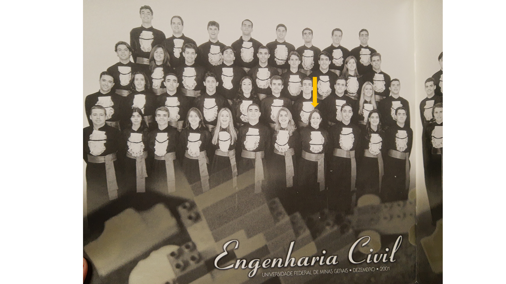
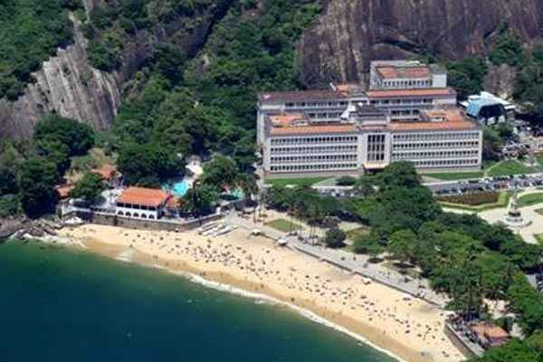
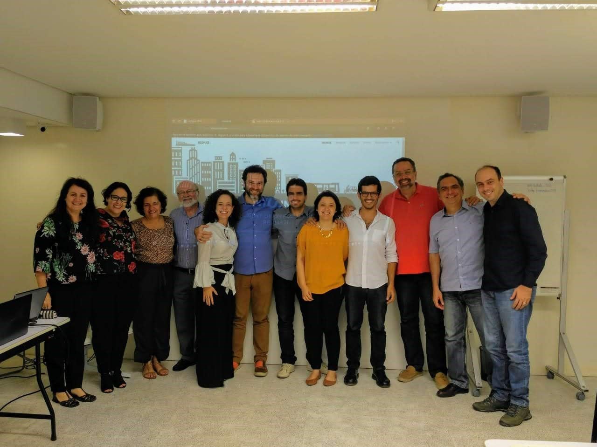

```{r child = "setup.Rmd"}
```

class: middle
background-image: url(img/imagem3.png)
background-size: contain


.enormous[
Enhancing and reducing distances.... 
]


.bigger[
.purple[
Lecture for the position "Assistant Professor progressing the transition to future transport solutions
]]


.purple[
24/05/2022
]

---
class: inverse

# Agenda

--

.large[
Understanding the world...
]

--
.large[
Learning and teaching...
]

--
.large[
Producing and sharing knowlegde for a better world...
]

--
.large[
Why Chalmers and where to go...
]

???

I have structured my presentation in four chronological sections! 

Understanding the world...

Learning and teaching...

Producing and sharing knowlegde for a better world...

Why Chalmers and where to go...

---

class: center
background-image: url(img/flower2.jpg)
background-size: cover

.enormous[
Understanding the world...
]

---
class: center, middle

```{r time, echo=FALSE, fig.cap="", message=FALSE, warning=FALSE, out.width="95%"}
knitr::include_graphics("img/understand.png")
```

???

The first stage of my life was an inductive exploration of the world! 


---

## That's 70s show

.pull-left[
```{r pais, echo=FALSE, out.width="90%"}
knitr::include_graphics("img/pais.jpg")
```  
]

.pull-right[
```{r reta-baby-1, echo=FALSE, fig.cap="", out.width="60%"}
knitr::include_graphics("img/gecy.jpg")
```
]

???

I was born in a traditional Brazilian family, back in 1979. Besides my parents, who look like they have just come out of a TV series from the 80's, my grandmother played an important party in this first stage of my life. 

---


## That's 70s show

```{r eu, echo=FALSE, out.width="55%"}
knitr::include_graphics("img/reta_baby_1.jpg")
```  

???


That's the cute version of me!

---
class: middle, center
background-image: url(img/bh_pic.png)
background-size: cover

???


I was born in Belo Horizonte, this crazy big and young metropolitan area in the southeast of Brazil. Crazy as every urban area with car-oriented planners, very little public transport and street design that does not allow pedestrians and bicycles to get around safely. 


--

```{r bh, echo=FALSE, out.width="65%"}
knitr::include_graphics("img/bh.png")
```  

???


For those of you that do not know where Belo Horizonte is, here is a little hint! 


---
background-image: url(img/idaho.png)
background-size: cover

???
I had a traditional adolescence, going crazy at the first time I played in the snow! This happened in my first international experience: a high school exchange program in Idaho-US.

It is hard to tell which picture I am more ashamed of. But my ecumene kept enlarging!

---

background-image: url(img/change1.jpg)
background-size: cover

.enormous[
Learning and teaching...
]

???

The second part I proposed for this presentation concerns the more deductive part of my life. Less exploration, more acquisition of knowledge, and mostly I found myself entrapped in an unequal and hypothetical world.

---
class: center, middle


```{r time1, echo=FALSE, fig.cap="", message=FALSE, warning=FALSE, out.width="95%"}
knitr::include_graphics("img/understanding1.png")
```

???

These were times to get a Bachelor's and Master's degree, a Postgraduation diploma, some professional experience and a lot of teaching experience! And a lot of LOVE! I kept expanding my ecumene and enhancing distances from the real tangible world (besides motherhood! what a well-grounded challenge!)

---


## Civil Engineering and carreer choice

.pull-left[
.bigger[
- Students council and institutional representation
- Undergrauduate Program for Scientific Initiation: **Residential Mobility and Transportation System in the Metropolitan Region of Belo Horizonte** 
- Final semester: **Transportation Engineering**
]]

.pull-right[
```{r civil1, echo=FALSE, fig.cap="", message=FALSE, warning=FALSE, out.width="80%"}
knitr::include_graphics("img/pexels-thirdman-5584052.jpg")
```
]

???

During my undergraduate studies, I explored possibilities that were a game changer in my professional journey. 

I was a member of the students council and responsible for institutional representation of s students body

I joined an Undergrauduate Program for Scientific Initiation in the project entitled “Residential Mobility and Transportation System in the Metropolitan Region of Belo Horizonte”.

And in my final semester, I enrolled myself in transportation engineering courses. 

Transportation was the only field of knowledge in my course that allowed me to identify challenges directly related to people. 

---

class: center


```{r forma, echo=FALSE, out.width="100%"}
knitr::include_graphics("img/forma.png")
```  

???

By the end of 2001 I got my Civil Engineering Bachelors' degree. But.... 

---
class: center

```{r forma1, echo=FALSE, out.width="100%"}

``` 

---

## M.Sc. Transportation Engineering

.pull-left[
```{r ime, echo=FALSE, out.width="100%"}


```
]

.pull-right[
.bigger[
- Military Institute of Engineering

- **Neuro-Fuzzy Model for Freight Transport Mode Choice**

- Supervisor: Prof. Marcus Vinícius Quintela Cury
]]

???
I wasn't sure I was well instructed to work as an transportation engineer. So I decided to get a master's degree. Once more, my ecumene expanded to Rio de Janeiro! But, since I had been working since I was 16 years-old, I decided to go back to Belo Horizonte and work while finishing the thesis. In the mean time.... 

---

## Postgraduate diploma in Railway Engineering

.pull-left[
.bigger[
Vale - PgDip. Transportation Engineering

**Analysis of the Increased Reliability of the Locomotives of the Grain Route after the Implementation of FCA's New Traction Scheme**
]]

.pull-right[
```{r vale, echo=FALSE, out.width="100%"}
knitr::include_graphics("img/vale.png")

```
]

???

I had the opportunity to get a postgraduate diploma at Vale in Railway Engineering and in 2004 I defended my thesis. 

---

## Professional experience in the industry

.pull-left[
```{r vale1, echo=FALSE, out.width="80%"}
knitr::include_graphics("img/logo-vale-1024.png")

```
]

.pull-right[
```{r systra, echo=FALSE, out.width="60%"}
knitr::include_graphics("img/systra-architects.png")

```
]

---

## Teaching experience

.bigger[
English Teacher

Novos Horizontes College    

Community Foundation for Higher Education of Itabira

Department of Transportation Engineering and Geotechnics - UFMG

**Federal Center for Technological Education of Minas Gerais**
]

???

Along with my studies, I experimented teaching... English teacher, lecturer in different institution.

---

## CEFET-MG

.bigger[.center[
**Transportation Engineering Department/ Department of Social Sciences**
]]

.bigger[
.pull-left[

Sub-coordination and coordination of Transportation Engineering undergraduate course   

Scientific Initiation and Junior Scientific Initiation students

Research Ethics Committee
]

.pull-right[
Thematic commitee for research projects assessment

Examining Boards for different positions in Technological Education career

Examining Boards of the simplified positions for temporary teachers

]]

---

## Teaching 

.pull-left[
.bigger[

Reduce distance among faculty and students

Students must be active parties in education

Fun - gamification and student protagonism
]]

.pull-right[
.bigger[
Teaching and learning - teaching to learn - Long life learning

Critical perspective

Adaptation

Study, study, study, and study some more!
]]

---
class: center, bottom
background-image: url(img/games.png)
background-size: cover


---

class: center, bottom
background-image: url(img/pexels-pixabay-63643.jpg)
background-size: cover

.enormous[
Producing and sharing knowlegde for a better world...
]

???


Finally reducing distances! Focusing on people, social justice and human scale cities...


---

```{r time2, echo=FALSE, fig.cap="", message=FALSE, warning=FALSE, out.width="95%"}
knitr::include_graphics("img/understanding2.png")
```

---

## Doctor's degree in Geography - Spatial Analysis

.pull-left[
.bigger[
**Spatial Analysis of the correlation among the location of grocery retailers, the average income of the population and prices policy: a case study for Belo Horizonte**
]

*Supervisor: Alexandre Magno Alves Diniz*

PUCMinas   
Institut Rhônalpin des Systèmes Complexes   
]

.pull-right[
```{r doc, echo=FALSE, fig.cap="", message=FALSE, warning=FALSE, out.width="95%"}
knitr::include_graphics("img/defesa.jpg")
```
]

---

## Research Groups and Networks

.bigger[
.pull-left[
<strike>Translog City</strike> 

NIUMAR - Network on Intelligent Urban Mobility and Accessibility research ❤️   
RedeTP@acesso ❤️

NOSS - Center for Organizational Studies, Society and Subjectivity ❤️  
    
PLACES - Planning for Access ❤️  

]]

.pull-right[
```{r niumar, echo=FALSE, out.width="100%"}
    
```
]

---
## Main research Projects

Fazer o mapa mental dos projetos e como se relacionam

.pull-left[
**Revisora**   
Transportes   
IEEE Access   
Sustainable Cities and Society   
Research in Transportation Economics   
Transportation Research Record   
Urban Rail Transit   
]

.pull-right[
**Corpo editorial**   
Caderno de geografia   
Revista Brasileira de Transportes.   
]

---

## Community involvement

.pull-left[
.bigger[
Horta da Cidade - social enterpreneurship ❤️

Paraíso do Tocantins Mobility Plan ❤️  

Tutorial Education Program ❤️
]]

.pull-right[
```{r horta, echo=FALSE, out.width="100%"}
knitr::include_graphics("img/horta.jpg")
```
]


---

## Postdoctoral Fellowship

.bigger[
**Relationships among urban characteristics, real estate market and spatial patterns of warehouses in different geographic contexts**


Logistics City Chair, da Université Gustave Eiffel   
*Laetitia Dablanc*  
]


---
## Main publications


---

## External Funding 

.pull-left[
.bigger[
**RENOVATE - Freight transport webGIS tools for livable cities**

MSCA Postdoctoral Fellowship 2021
]]

.pull-right[
```{r echo=FALSE, message=FALSE, warning=FALSE, out.width="55%"}
knitr::include_graphics("img/2022-05-06 22_30_58-Seal of Excellence.pdf - Foxit Reader.png")
```
]


---
class: center, bottom
background-image: url(img/arun-clarke-VAxzTA5IStU-unsplash.jpg)
background-size: cover


.enormous[
Why Chalmers and where to go...
]

---

Contribute to building better places to live, human scale cities and social justice - And this is what drives Chalmers

Communicating Science - OpenScience

Develop a research identity, stimulate students para envolvimento em projetos com objetivo social e sustentável, life long learning (myself, my coworkers, my students and people from the community)

---

class: center
background-image: url(img/pexels-monstera-5874738.jpg)
background-size: cover

.bold[
.large[
**“To TEACH, one needs Eros” Plato**

**To LEARN, one needs Eros. Renata**

**To produce KNOWLEDGE, one needs Eros. Renata**
]]

---

class: bottom, center
background-image: url(img/dist.jpg)
background-size: cover

.enormous[
.center[
Keep reducing distances at Chalmers
]]

---

class: middle, inverse


.larger[
.center[
THANK YOU!
]]

&nbsp;
<hr />

<p style="text-align: center;"><span style="color: #ebdb00;"><em>renataoliveira@gmail.com</em></span></p>

<!-- Add icon library -->
<link rel="stylesheet" href="https://cdnjs.cloudflare.com/ajax/libs/font-awesome/4.7.0/css/font-awesome.min.css">

<link rel="stylesheet" href="https://cdn.jsdelivr.net/gh/jpswalsh/academicons@1/css/academicons.min.css">


<!-- Add font awesome icons -->
<p style="text-align: center;">
    <a href="https://twitter.com/retaoliveira?lang=en" class="fa fa-twitter fa-2x"></a>&nbsp;&nbsp;
    <a href="https://github.com/retaoliveira" class="fa fa-github fa-2x"></a>&nbsp;&nbsp;
    <a href="https://scholar.google.com/citations?user=V6EX45EAAAAJ" class="ai ai-google-scholar ai-2x"></a>&nbsp;&nbsp;
    <a href="https://orcid.org/0000-0002-9011-2342" class="ai ai-orcid ai-2x"></a>&nbsp;&nbsp;
    <a href="http://lattes.cnpq.br/2642488704355833" class="ai ai-lattes ai-2x"></a>&nbsp;&nbsp;
    <a href="https://github.com/retaoliveira/relements/raw/main/texto/index.pdf" class="ai ai-cv ai-2x"></a>

</p>

&nbsp;


