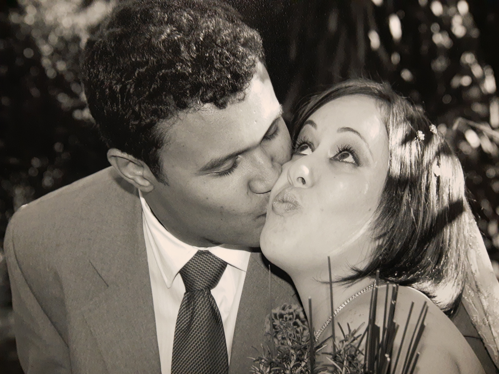
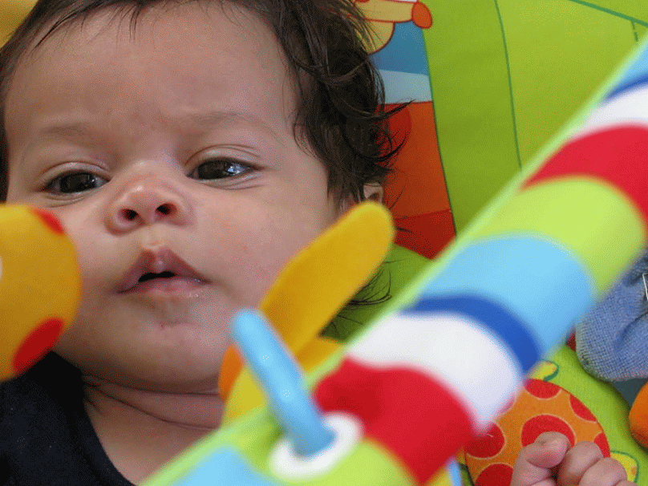
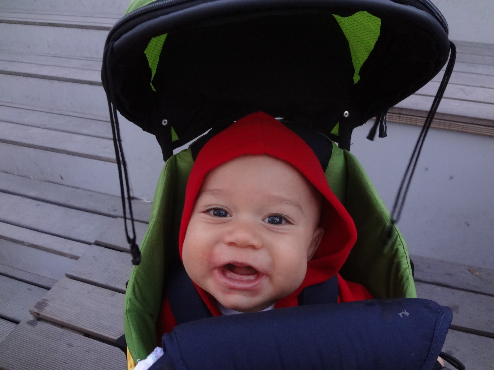
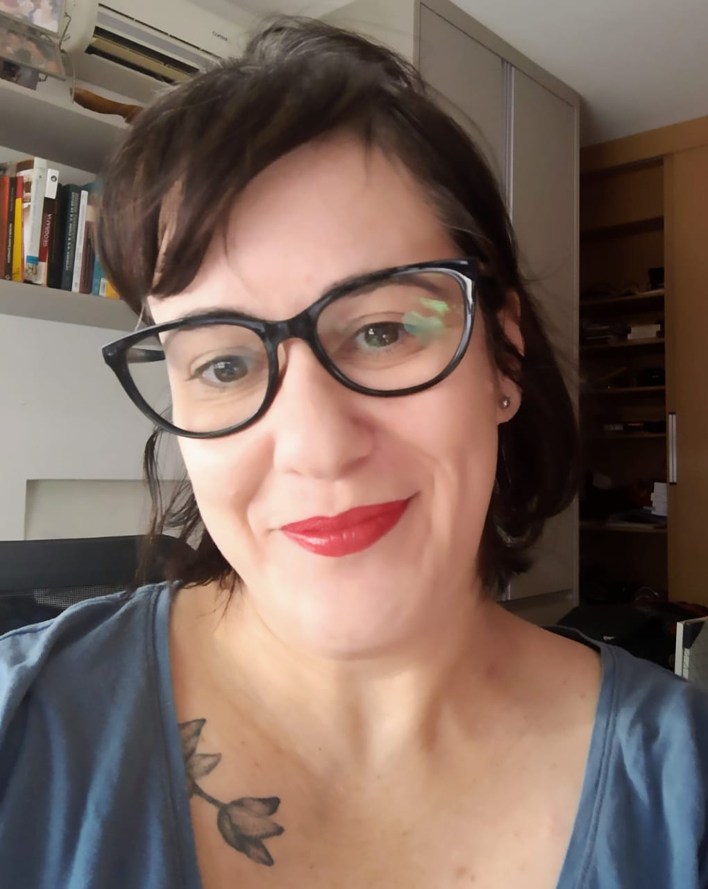

```{r child = "setup.Rmd"}
```

class: middle
background-image: url(img/imagem3.png)
background-size: contain

.huge[
.center[
Reducing distances.... 
]]

<br></br>


.purple[
.bigger[
**Lecture for the position "Assistant Professor progressing the transition to future transport solutions"**
]]


.purple[
Renata Oliveira   
24/05/2022
]

---
background-image: url(img/joanna-kosinska-1_CMoFsPfso-unsplash.jpg)
background-size: cover

## Agenda

.large[
.bold[
.pull-right-wide[
Who am I?

Why academic life?

Teaching and research experience

Where I want to go?

About people...
]]]


---

```{r eval=FALSE, include=FALSE}
library(lares)
cols <- c("Role", "Place", "Type", "Start", "End")
today <- as.character(Sys.Date())
cv <- data.frame(rbind(
  c("B.Sc. Civil Engineering", "UFMG", "Education", "1997-02-01", "2002-01-08"),
  c("PgDip.in Railway Engineering", "Vale", "Education", "2003-09-15", "2004-04-20"),
  c("M.Sc. Transportation Engineering", "IME", "Education", "2002-02-01", "2004-08-02"),
  c("D.Sc. Geography", "PUCMinas", "Education", "2011-02-01", "2015-08-20"),
  c("Assistant lecturer", "", "Work Experience", "2003-01-01", "2006-02-09"),
  c("Teaching and research fellow", "UFMG", "Work Experience", "2017-08-01", "2021-07-01"),
  c("Postdoctoral researcher", "Université Gustave Eiffel", "Work Experience", "2020-10-01", "2021-06-30"),
  c("Transportion and Urban Planner", "IAC-UFT", "Work Experience", "2020-07-01", "2021-01-31"),
  c("Railway Engineer", "Vale", "Work Experience", "2003-09-15", "2005-05-01"),
  c("Consultant in Transporation Engineering", "Systra/Tectran", "Work Experience", "2003-02-01", "2003-09-15"),
  c("Professor and researcher", "CEFET-MG", "Work Experience", "2006-02-10", today),
  c("Patrick", "My love", "Heart", "2001-05-31", today),
  c("Sofia", "More love", "Heart", "2009-09-01", today),
  c("João", "More and more love", "Heart", "2012-12-05", today)
))
colnames(cv) <- cols
heart <- emo::ji("heart")
plot_timeline(event = cv$Role, 
              start = cv$Start, 
              end = cv$End, 
              label = cv$Place, 
              # Simple trick to re-arrange the grids
              group = factor(cv$Type, levels = c("Education", "Work Experience", "Heart")),
              interactive = F,
              title = "Reducing distances...",
              subdir = "Renata Oliveira")
```


---
```{r eval=FALSE, include=FALSE}
library(plotly)

df <- read.csv("https://cdn.rawgit.com/plotly/datasets/master/GanttChart-updated.csv", 
               stringsAsFactors = F)

df$Start  <- as.Date(df$Start, format = "%m/%d/%Y")
client    <- "Sample Client"
cols      <- RColorBrewer::brewer.pal(length(unique(df$Resource)), name = "Set3")
df$color  <- factor(df$Resource, labels = cols)

p <- plot_ly()
for(i in 1:(nrow(df) - 1)){
  p <- add_trace(p,
                 x = c(df$Start[i], df$Start[i] + df$Duration[i]), 
                 y = c(i, i), 
                 mode = "lines",
                 line = list(color = df$color[i], width = 20),
                 showlegend = F,
                 hoverinfo = "text",
                 text = paste("Task: ", df$Task[i], "<br>",
                              "Duration: ", df$Duration[i], "days<br>",
                              "Resource: ", df$Resource[i]),
                 evaluate = T
  )
}

p
```


---


```{r eval=FALSE, include=FALSE}
# All packages used below must be installed first
library(devtools)
# devtools::install_github("laresbernardo/lares")
library(lares)
library(ggplot2)
library(hrbrthemes)
library(ggrepel)
library(tidyverse)


plot_timeline2 <- function(event, start, end = start + 1, label = NA, group = NA,
                           title = "", subtitle = "", size = 8, colour = "red", save = FALSE, subdir = NA) {
   
  df <- data.frame(Role = as.character(event), 
                   Place = as.character(label),
                   Start = lubridate::date(start), 
                   End = lubridate::date(end), 
                   Type = group)
  
  cvlong <- data.frame(pos = rep(as.numeric(rownames(df)),2), 
                       name = rep(as.character(df$Role), 2), 
                       type = rep(factor(df$Type, levels = c("Life", "Education", "Work\n Teaching and\n research", "Work\n industry", "Heart")), 2), 
                       where = rep(as.character(df$Place),2), value = c(df$Start, df$End), label_pos = rep(df$Start + floor((df$End - df$Start)*2), 2))
  
  maxdate <- max(df$End)
  
  p <- ggplot(cvlong, aes(x = value, y = reorder(name, -pos), label = where, group = pos)) +
       geom_vline(xintercept = maxdate, alpha = 0.8,  linetype = "dashed") + 
       labs(title = title, subtitle = subtitle, x = NULL, y = NULL, colour = NULL) +
       theme_ipsum() + 
       theme(panel.background = element_rect(fill = "white", colour = NA), 
             axis.ticks = element_blank(), 
             panel.grid.major.x = element_line(size = 0.25, colour = "grey80"))

if (!is.na(cvlong$type)[1] | length(unique(cvlong$type)) > 1) {
    p <- p + geom_line(aes(color = type), size = size) +
             facet_grid(type ~ ., scales = "free", space = "free") +
             guides(colour = FALSE) +
             scale_colour_manual(values = c("#8fada7", "#7c839f", "#a19aa3", "#a46e7c", "#635867" ))
  }
  else {
    p <- p + geom_line(size = size, colour = colour) 
  }
     p <- p +  annotate(geom = "curve", x = 4, y = 35, xend = 2.65, yend = 27, curvature = .3, arrow = arrow(length = unit(2, "mm"))) +
               annotate(geom = "text", x = 4.1, y = 35, label = "TEste", hjust = "left")
     
    #p <- p + geom_label_repel(aes(x = label_pos), family = "Arial", size = 3, min.segment.length = 0,  seed = 42,  box.padding = 0.5, max.overlaps = Inf, arrow = arrow(length = unit(0.010, "npc")), nudge_x = .15, nudge_y = .5, color = "grey50")
  
  
  if (save) {
    file_name <- "cv_timeline.png"
    if (!is.na(subdir)) {
      dir.create(file.path(getwd(), subdir), recursive = T)
      file_name <- paste(subdir, file_name, sep = "/")
    }
    p <- p + ggsave(file_name, width = 8, height = 6)
    message(paste("Saved plot as", file_name))
  }
  return(p)
}
order <- c("Role", "Place", "Type", "Start", "End")
today <- as.character(Sys.Date())
### Edit from here ###
cv <- data.frame(rbind(
  c("Basic education", "BH", "Education", "1979-06-01", "1996-12-01"),
  c("B.Sc. Civil Engineering", "UFMG", "Education", "1997-02-01", "2002-01-08"),
  c("PgDip.in Railway Engineering", "Vale", "Education", "2003-09-15", "2004-04-20"),
  c("M.Sc. Transportation Engineering", "IME", "Education", "2002-02-01", "2004-08-02"),
  c("D.Sc. Geography", "PUCMinas", "Education", "2011-02-01", "2015-08-20"),
  c("Patrick", "My love", "Heart", "2001-05-31", today),
  c("Sofia", "More love", "Heart", "2009-09-01", today),
  c("João", "More and more love", "Heart", "2012-12-05", today),
  c("English Teacher", "Home", "Work\n Teaching and\n research", "1996-03-01", "2001-06-30"),
  c("Assistant lecturer", "Different institutions", "Work\n Teaching and\n research", "2003-01-01", "2006-02-09"),
  c("Teaching and research fellow", "UFMG", "Work\n Teaching and\n research", "2017-08-01", "2021-07-01"),
  c("Teaching and research", "CEFET-MG", "Work\n Teaching and\n research", "2006-02-10", today),
  c("Postdoctoral researcher", "Gustave Eiffel", "Work\n Teaching and\n research", "2020-10-01", "2021-06-30"),
  c("Transportion and Urban Planner", "IAC-UFT", "Work\n industry", "2020-07-01", "2021-01-31"),
  c("Railway Engineer", "Vale", "Work\n industry", "2003-09-15", "2005-05-01"),
  c("Consultant in Transporation Engineering", "Systra/Tectran", "Work\n industry", "2003-02-01", "2003-09-15"),
  c("Birth", "BH", "Life", "1979-02-26", today),
  c("International experience", "Idaho-US", "Life", "1995-08-01", "1996-02-01"),
  c("International experience", "France", "Life", "2013-06-20", "2013-12-31")
))


### Edit until here ###
colnames(cv) <- order
colour <- c("#45776D", "#454F77", "#635867", "#7e3145")
x <- plot_timeline2(
  event = cv$Role,
  start = cv$Start,
  end = cv$End,
  label = cv$Place,
  group = cv$Type,
  save = FALSE)  # replace with your name

x

       #geom_label_repel(aes(x = label_pos), size = 2, min.segment.length = 0,  seed = 42,  box.padding = 0.05, max.overlaps = Inf, arrow = arrow(length = unit(0.010, "npc")), nudge_x = .05, nudge_y = .05, color = "grey50", show.legend = FALSE)

p
      # annotate(geom = "curve", x = as.Date(cvlong$label_pos), y = 0.05, xend = 2.65, yend = 27, curvature = .3, arrow = arrow(length = unit(2, "mm"))) +
      # annotate(geom = "text", x = as.Date(cvlong$label_pos), y = 0.05, label = "Teste", hjust = "left")
p


ggsave("cv_timeline.png", width = 8, height = 6)
```  

```{r echo=FALSE, message=FALSE, warning=FALSE}
# All packages used below must be installed first
library(devtools)
# devtools::install_github("laresbernardo/lares")
library(lares)
library(ggplot2)
library(hrbrthemes)
library(ggrepel)
library(tidyverse)
library(plotly)

order <- c("Role", "Place", "Type", "Start", "End")

today <- as.character(Sys.Date())

cv <- data.frame(rbind(
  c("Basic education", "BH", "Education", "1979-06-01", "1996-12-01"),
  c("B.Sc. Civil Engineering", "UFMG", "Education", "1997-02-01", "2002-01-08"),
  c("PgDip.in Railway Engineering", "Vale", "Education", "2003-09-15", "2004-04-20"),
  c("M.Sc. Transportation Engineering", "IME", "Education", "2002-02-01", "2004-08-02"),
  c("D.Sc. Geography", "PUCMinas", "Education", "2011-02-01", "2015-08-20"),
  c("Patrick", "My love", "Heart", "2001-05-31", today),
  c("Sofia", "More love", "Heart", "2009-09-01", today),
  c("João", "More and more love", "Heart", "2012-12-05", today),
  c("English Teacher", "Home", "Work\n Teaching and\n research", "1996-03-01", "2001-06-30"),
  c("Assistant lecturer", "Different institutions", "Work\n Teaching and\n research", "2003-01-01", "2006-02-09"),
  c("Teaching and research fellow", "UFMG", "Work\n Teaching and\n research", "2017-08-01", "2021-07-01"),
  c("Teaching and research", "CEFET-MG", "Work\n Teaching and\n research", "2006-02-10", today),
  c("Postdoctoral researcher", "Gustave Eiffel", "Work\n Teaching and\n research", "2020-10-01", "2021-06-30"),
  c("Transportion and Urban Planner", "IAC-UFT", "Work\n industry", "2020-07-01", "2021-01-31"),
  c("Railway Engineer", "Vale", "Work\n industry", "2003-09-15", "2005-05-01"),
  c("Consultant in Transporation Engineering", "Systra/Tectran", "Work\n industry", "2003-02-01", "2003-09-15"),
  c("Birth", "BH", "Life", "1979-02-26", today),
  c("International experience", "Idaho-US", "Life", "1995-08-01", "1996-02-01"),
  c("International experience", "France", "Life", "2013-06-20", "2013-12-31")
))

colnames(cv) <- order

event = cv$Role
start = cv$Start
end = cv$End
label = cv$Place
group = cv$Type
  
df <- data.frame(Role = as.character(event), 
                   Place = as.character(label),
                   Start = lubridate::date(start), 
                   End = lubridate::date(end), 
                   Type = group)

cvlong <- data.frame(pos = rep(as.numeric(rownames(df)),2), 
                     name = rep(as.character(df$Role), 2), 
                     type = rep(factor(df$Type, levels = c("Life", "Education", "Work\n Teaching and\n research", "Work\n industry", "Heart")), 2), 
                     where = rep(as.character(df$Place),2), value = c(df$Start, df$End), 
                     label_pos = as.Date(df$Start))
  
maxdate <- max(df$End)
size = 8

p <- ggplot(cvlong, aes(x = value, y = reorder(name, -pos), label = where, group = pos)) +
       geom_vline(xintercept = maxdate, alpha = 0.8,  linetype = "dashed") + 
       labs(x = NULL, y = NULL, colour = NULL) +
       theme_ipsum() + 
       theme(panel.background = element_rect(fill = "white", colour = "white"), 
             axis.ticks = element_blank(), 
             panel.grid.major.x = element_line(size = 0.25, colour = "grey80"),
             legend.position="none") +
       geom_line(aes(color = type), size = size) +
             facet_grid(type ~ ., scales = "free", space = "free") +
             scale_colour_manual(values = c("#8fada7", "#7c839f", "#a19aa3", "#a46e7c", "#635867" )) 
plotly(username = p)
p


ggsave("cv_timeline.png", width = 15, height = 6)

```


---
class: center, middle
background-image: url(img/flower2.jpg)
background-size: cover

# Who am I?

##That's 70s show

.pull-left[
```{r pais, echo=FALSE, fig.cap="1979", out.width="90%"}
knitr::include_graphics("img/pais.jpg")
```  
]

.pull-right[
```{r reta-baby-1, echo=FALSE, fig.cap="", out.width="70%"}
knitr::include_graphics("img/gecy.jpg")
```
]

???

IMG_20210513_194541444

I was born in 1979, in Belo Horizonte, Brazil. 


---

class: middle, center

# Who am I?

```{r bh, echo=FALSE, out.width="80%"}
knitr::include_graphics("img/bh.png")
```  


---

class: center
background-image: url(img/idaho.jpg)
background-size: cover

.pull.right[

```{r echo=FALSE, fig.cap="", out.width="10%", fig.align='right'}
knitr::include_graphics("img/idaho.png")
```

]

---

background-image: url(img/teach.jpg)
background-size: cover


---

background-image: url(img/eng.jpg)
background-size: cover

---

class: bottom, center
background-image: url(img/all1.jpg)
background-size: cover

.green[
.larger[
Identidade como engenheira
]
]

---

class: center, middle
background-image: url(img/room1.jpg)
background-size: cover

.pink[
.larger[
Representação discente
]
]

---

background-image: url(img/mobility.jpg)
background-size: cover

# Iniciação científica


.bold[
.pull-left[
“Mobilidade Residencial e Sistema de Transporte na Região Metropolitana de Belo Horizonte” 


Prof. David José Ahouagi Vaz de Magalhães
]
]


---

class: bottom, center
background-image: url(img/transport.jpg)
background-size: cover


.yellow[
.larger[
Engenharia de transportes
]
]

---

class: bottom, center
background-image: url(img/forma.jpg)
background-size: cover

.yellow[
.larger[
 2001/2002
]]

---

background-image: url(img/ime.jpg)
background-size: cover


# Mestrado

.yellow[
.pull-left[
.large[
Instituto Militar de Engenharia

]
]
]

<br></br>
<br></br>
<br></br>
<br></br>

.center[
.larger[
.yellow[
2002
]]]

---

background-image: url(img/change1].jpg)
background-size: cover

.larger[
2003
]

--

.pull-left[
.large[
.bold[
Tectran - Ramón Vitor César   
]]]

--

.pull-left[
.large[
.bold[
Faculdade Novos Horizontes   
]]]

--

.pull-left[
.large[
.bold[
Vale - Engenharia Ferroviária
]
]
]

---

.pull-left-wide[
```{r vale, echo=FALSE, fig.cap="", out.width="100%"}
knitr::include_graphics("img/vale.png")
```
]

.pull-right-narrow[
.bold[

Estudos operacionais
]


.bold[

VPL

PPC

Especialização em Engenharia Ferroviária
]

Análise do Aumento de Confiabilidade das Locomotivas da Rota do Grão a Partir da Implantação do Novo Quadro de Tração da FCA

]


---

background-image: url(img/master.jpg)
background-size: cover

.larger[
2004
]

.large[
Neuro-Fuzzy Model for Modal Choice in Freight Transport
]

Supervisor: *Marcus Vinícius Quintella Cury*

.center[
.larger[
.pink[
c
]]]

---


.pull-left[
.large[
.larger[
2005
]
.bold[
New Horizons College    

Community Foundation for Higher Education of Itabira

Department of Transportation Engineering and Geotechnics - UFMG
]
]
]

.pull-right[
```{r , echo=FALSE, fig.cap="", out.width="100%"}
knitr::include_graphics("img/teacher.jpg")
```
.center[
.green[
Tender for CEFET-MG
]
]
]


---

background-image: url(img/cefet1.png)

.larger[

2006 - 2009
]


.bold[
Technical courses in Transportation and Traffic
]

--

.bold[
Coordenação de laboratórios
]

--

.bold[
Coordenação de cursos
]

--

.bold[
Transportation Engineering
c

]

---

background-image: url(img/puc.png)
background-size: container

.larger[
2010-2015
]


.bold[
.large[
Geography - Spatial Information Treatment   
]]

*Oswaldo Bueno Amorim Filho*   
*Alexandre Magno Alves Diniz*

.bold[
.large[
Período sanduíche no Institut Rhônalpin des Systèmes Complexes   
]
]

*Prof. Pablo Jensen*


---


background-image: url(img/mps.jpg)
background-size: cover


.larger[
2015
]

.bold[
.large[
Análise Espacial dos Preços de Produtos Alimentícios no Varejo de Belo Horizonte e sua relação com a renda média da população   
Orientação: *Alexandre Magno Alves Diniz*

]]

.center[
.larger[
.pink[
Acessibilidade
]]]

---

# 2017 - 2021

.bold[
Programa de mestrado em Geotecnia e Transportes da UFMG   
]

.midi[
-   Clarissa Pontes Melo - Análise da macroacessibilidade de pedestres idosos sob a ótica da qualidade do espaço urbano. 2021.

-   André Augusto Cunha Libânio - Avaliação da acessibilidade em cidades brasileiras. 2020.

-   Paulo Henrique Góes Pinto - Identificação e qualificação de centralidades urbanas por meio de estrutura morfológico-funcional: um estudo de caso para a RMBH. 2020.

-   José Moreira Gonçalves - Atração de Viagens de Carga em Indústria Automobilística de Máquinas Agrícolas e Rodoviárias. 2019.

-   Gabriela Pereira Lopes - Uma Análise da Localização de Instalações Logísticas versus Geração de Viagens e os Impactos na mobilidade urbana em Belo Horizonte. 2018.
]

---

background-image: url(img/cefet1.png)

.bold[
.larger[
2015 - 2019  
]]

Departamento de Engenharia de Transportes   
Sub-coordenação e depois coordenação da Engenharia de Transportes   
Introdução à Engenharia de Transportes ❤️   
Alunos de Iniciação Científica e Iniciação Científica Júnior

.pull-right[
```{r enge, echo=FALSE, fig.cap="Encontro Nacional dos coordenadores de cursos de graduação", message=FALSE, warning=FALSE, fig.align = 'center',out.width="100%"}
knitr::include_graphics("img/enges.jpg")
```
]

---
background-image: url(img/cefet1.png)


.bold[
.larger[
2015...   
Administração
]]

.bold[
.midi[
-   Comitê de Ética em Pesquisa CEP/CEFET-MG;
-   Câmaras Temáticas da Comissão de Iniciação;
-   Participação em Bancas Examinadoras do Concurso Público de Provas e Títulos para provimento de cargas da carreira de Magistério do Ensino Básico, Técnico e Tecnológico;
-   Participação em bancas examinadoras de processo seletivo simplificado para professores substitutos/temporários;
-   Outras comissões temporárias;
]]

---


.pull-left[
.bold[
.larger[
2017...   
Pesquisa
]]

.bold[
.midi[
Translog City   

NIUMAR - Network on Intelligent Urban Mobility and Accessibility research ❤️   

PLACES - Planning for Access ❤️  

NOSS - Núcleo de Estudos Organizacionais e Sociedade e Subjetividade ❤️  
]]
]

.pull-right[
    ```{r niumar, echo=FALSE, fig.cap="2o Workshop da NIUMAR", out.width="100%"}
    knitr::include_graphics("img/niumar.jpg")
    ```
]

---

background-image: url(img/fundo2.png)
background-size: cover

```{r echo=FALSE, message=FALSE, warning=FALSE, out.width="90%"}
knitr::include_graphics("img/2022-05-06 22_30_58-Seal of Excellence.pdf - Foxit Reader.png")
```


.bold[
.larger[
Pesquisa
]]

.pull-left[
**Revisora**   
Transportes   
IEEE Access   
Sustainable Cities and Society   
Research in Transportation Economics   
Transportation Research Record   
Urban Rail Transit   
]

.pull-right[
**Corpo editorial**   
Caderno de geografia   
Revista Brasileira de Transportes.   
]


---

.pull-left[
.bold[
.larger[
2018 ...    
Extensão
]]

.bold[
.midi[

Horta da Cidade   

Plano de mobilidade de Paraíso do Tocantins   

I Fórum Brasileiro de Logística Urbana   

PET - Adm ❤️
]
]]

.pull-right[

```{r horta, echo=FALSE, fig.cap="Evento no Sebrae - Horta da Cidade", out.width="100%"}
knitr::include_graphics("img/horta.jpg")
```
]


---

# 2020 ...


.bold[
Programa de mestrado Administração do CEFET-MG
]

*Processos e sistemas decisórios em arranjos organizacionais*

-  Sofia Eleutério - trabalho sobre o processo decisório quanto à implementação de faixas exclusivas de ônibus como política pública.
- Felipe - caracterização da atividade e políticas públicas para vendedores ambulantes em BH   
- Fernando - Redes sociais para analisar a relação entre filiação partidária e cargos comissionados no governo federal

Colegiado do PPGA


---

background-image: url(img/cefet1.png)

.bold[
.larger[
2020 ...
]
Departamento de Ciências Sociais Aplicadas
]

*Novas disciplinas*   
*Novas perspectivas*   
*Novas parcerias*

Colegiado de Administração

---

.bold[
.larger[
2018 ...    
Internacionalização
]]

.midi[
4th VREF Conference. Relationships among urban characteristics, real estate market and spatial patterns of warehouses in different geographic contexts. 2021.

11th International Conference on City Logistics. EXPLORATORY ANALYSIS OF THE ACCESSIBILITY TO FOOD RETAILERS IN BELO HORIZONTE. 2019. 

15th biannual NECTAR Conference. ACCESSIBILITY TO FOOD SYSTEMS IN BELO HORIZONTE, BRAZIL. 2019. ❤️

6th workshop NIUMAR. Projects under development and research agenda. 2019. ❤️
]

---

.bold[
.larger[
2018 ...    
Internacionalização
]]

.midi[

1st Brazilian EMI. 2018.

3rd workshop NIUMAR. Perspectivas de parceria. 2018. ❤️

4th workshop NIUMAR. Encaminhamentos. 2018. ❤️

Workshop do Cluster 2 do Nectar. A sustainable business model for urban farming based on city logistics concepts for local production and consumption of vegetables. 2018. ❤️


]

---


.bold[
.larger[
2018 ...    
Internacionalização
]]

.midi[
Efficiency in Urban Logistics: Current challenges, innovative & green solutions. 2017.

Researchers Links Workshop: How the Railways contribute to improving quality of life?. Researchers Links Workshop. 2017. ❤️

2nd workshop da NIUMAR. Desenvolvimento de pesquisa. 2018. (Seminário). ❤️

Semana Internacional de Engenharia Metroferroviária, Transportes e Logística. Análise espacial aplicada a soluções para o último quilômetro. 2017.


]

---
.bold[
.larger[
2018 ...    
Internacionalização
]]

.midi[


Tenth International Conference on City Logistics. Urban Distribution of Craft-Brewed Beer in Belo Horizonte Metropolitan Area. 2017.

Cyprien Legros   
Jonathan Reith   
Joanna Wilkolek   
Neda Marjanovic   
]

---

.bold[
.larger[
2020 - 2021    
Pós-doutorado remoto
]]

.bold[
.large[
Relationships among urban characteristics, real estate market and spatial patterns of warehouses in different geographic contexts.
]]

Logistics City Chair, da Université Gustave Eiffel   
*Laetitia Dablanc*  


---
class: center
background-image: url(img/future.jpg)
background-size: cover


# E o futuro?


---

class: middle, center
background-image: url(img/butterfly.jpg)
background-size: cover


---

.bold[
.large[
Ensinar sem saber - ser curadora - ensinar a aprender
]]

--

.bold[
.large[
Perspectiva crítica até nas disciplinas mais positivistas
]]

--

.bold[
.large[
Diversão - gamificação e protagonismo do estudante
]]

--

.bold[
.large[
Adaptação - Ensino Remoto Emergencial
]]

--

.bold[
.large[
Estudar, estudar, estudar e estudar mais ainda!
]]

--

.bold[
.large[
Contribuir para a construção de melhores lugares para se viver
]]

--

.bold[
.large[
Comunicação da ciência - OpenScience
]]

---


class: center
background-image: url(img/passion.jpg)
background-size: cover


> “Para ENSINAR, necessita-se de Eros” Platão

> Para APRENDER, necessita-se de Eros. Renata

> Para produzir CONHECIMENTO, necessita-se de Eros. Renata

---

class: middle, center
background-image: url(img/together.jpg)
background-size: cover

---

class: bottom, center
background-image: url(img/dist.jpg)
background-size: cover

.larger[
Reduzir distâncias....
]
---

class: bottom, center
background-image: url(img/SMILE.jpg)
background-size: cover

.larger[
Sempre há esperança!
]

---

# Inspirações

Camila Soares Henrique Fontanele Garcia

Carlos Felipe Grangeiro Loureiro

André Soares Lopes

Camila Bandeira Cavalcante

Francelino Franco Leite de Matos Sousa

Francisco Gildemir Ferreira da Silva

Bruno Vieira Bertoncini

---

# Inspirações

Lílian dos Santos Fontes Pereira Bracarense

José Geraldo Vidal Vieira

Lucélia Viviane Vaz Raad

Ludmila de Vasconcelos Machado Guimarães

Joana Ancila Pessoa Forte Avelino

E muitas outras pessoas que marcaram minha vida!


---

# Onde bate meu coração ...

❤️Maio de 2001 - Começamos a namorar!   
❤️Setembro de 2001 - Ficamos noivos!   
❤️Dezembro de 2002 - Moramos juntos!   
❤️Julho de 2005 - Casamos!   
❤️Novembro de 2009 - Chegada da Sofia nas nossas vidas!   
❤️Dezembro de 2012 - Chegada do João nas nossas vidas!   
❤️Maio de 2021 - Sigo a mulher, mãe, professora, pesquisadora e cidadã mais feliz do mundo!

---

class: center, middle

.larger[
❤️**Amo vocês!**❤️
]

---

```{r nos2, echo=FALSE, fig.cap="Respeito", message=FALSE, warning=FALSE, out.width="70%"}

```

---

```{r nos3, echo=FALSE, fig.cap="Gratidão", message=FALSE, warning=FALSE, out.width="70%"}
knitr::include_graphics("img/nos3.jpg")
```

---

```{r sofia, echo=FALSE, fig.cap="Fulustreca", message=FALSE, warning=FALSE, out.width="70%"}

```

---

```{r sofia2, echo=FALSE, fig.cap="Zequinha", message=FALSE, warning=FALSE, out.width="50%"}
knitr::include_graphics("img/sofia2.png")
```

---

```{r joao, echo=FALSE, fig.cap="Zezé", message=FALSE, warning=FALSE, out.width="70%"}

```

---

```{r joao2, echo=FALSE, fig.cap="Chouchou", message=FALSE, warning=FALSE, out.width="50%"}
knitr::include_graphics("img/joao2.png")
```


---

class: inverse

.link_style[
.pull-left[

[Lattes](http://lattes.cnpq.br/2642488704355833)

[Orcid](https://orcid.org/0000-0002-9011-2342)

[Google Scholar](https://scholar.google.com/citations?user=V6EX45EAAAAJ)

[CV](https://github.com/retaoliveira/relements/raw/main/texto/index.pdf)

]]

.pull-right[

```{r , echo=FALSE,message=FALSE, warning=FALSE, out.width="40%"}

```

```{r , echo=FALSE,message=FALSE, warning=FALSE, out.width="40%"}
knitr::include_graphics("img/reta.jpg")
```
]

---


class: bottom, center
background-image: url(img/wordcloud.png)
background-size: cover

.larger[
.pink[
**Muito obrigada**!
]]


---

```{r eval=FALSE, include=FALSE}
library(ggwordcloud)
#> Loading required package: ggplot2
data("love_words_small")
set.seed(42)
ggplot(love_words_small, aes(label = word, size = speakers)) +
  geom_text_wordcloud() +
  scale_size_area(max_size = 40) +
  theme_minimal()
```

---

class: middle


❤️❤️


.pull-left[
```{r nos2, echo=FALSE,  message=FALSE, warning=FALSE, out.width="70%"}

```
]

❤️❤️
.pull-right[
```{r nos3, echo=FALSE,  message=FALSE, warning=FALSE, out.width="70%"}
knitr::include_graphics("img/nos3.jpg")
```
]

---
class: middle


❤️❤️


.pull-left[
```{r sofia, echo=FALSE,  message=FALSE, warning=FALSE, out.width="70%"}

```
]
❤️❤️
.pull-right[
```{r sofia2, echo=FALSE,  message=FALSE, warning=FALSE, out.width="50%"}
knitr::include_graphics("img/sofia2.png")
```
]

---

class: middle

❤️❤️
.pull-left[
```{r joao, echo=FALSE, message=FALSE, warning=FALSE, out.width="70%"}

```
]

❤️❤️
.pull-right[
```{r joao2, echo=FALSE, message=FALSE, warning=FALSE, out.width="50%"}
knitr::include_graphics("img/joao2.png")
```
]

---

---

.bold[
.larger[
2018 ...    
Internacionalização
]]

.midi[
4th VREF Conference. Relationships among urban characteristics, real estate market and spatial patterns of warehouses in different geographic contexts. 2021.

11th International Conference on City Logistics. EXPLORATORY ANALYSIS OF THE ACCESSIBILITY TO FOOD RETAILERS IN BELO HORIZONTE. 2019. 

15th biannual NECTAR Conference. ACCESSIBILITY TO FOOD SYSTEMS IN BELO HORIZONTE, BRAZIL. 2019. ❤️

6th workshop NIUMAR. Projects under development and research agenda. 2019. ❤️
]

---

.midi[

1st Brazilian EMI. 2018.

3rd workshop NIUMAR. Perspectivas de parceria. 2018. ❤️

4th workshop NIUMAR. Encaminhamentos. 2018. ❤️

Workshop do Cluster 2 do Nectar. A sustainable business model for urban farming based on city logistics concepts for local production and consumption of vegetables. 2018. ❤️


]

---


.midi[
Efficiency in Urban Logistics: Current challenges, innovative & green solutions. 2017.

Researchers Links Workshop: How the Railways contribute to improving quality of life?. Researchers Links Workshop. 2017. ❤️

2nd workshop da NIUMAR. Desenvolvimento de pesquisa. 2018. (Seminário). ❤️

Semana Internacional de Engenharia Metroferroviária, Transportes e Logística. Análise espacial aplicada a soluções para o último quilômetro. 2017.
]

Tenth International Conference on City Logistics. Urban Distribution of Craft-Brewed Beer in Belo Horizonte Metropolitan Area. 2017.

Cyprien Legros   
Jonathan Reith   
Joanna Wilkolek   
Neda Marjanovic   
]

---

---

## Graduate Students

- Sofia Eleutério - trabalho sobre o processo decisório quanto à implementação de faixas exclusivas de ônibus como política pública.
- Felipe - caracterização da atividade e políticas públicas para vendedores ambulantes em BH   
- Fernando - Redes sociais para analisar a relação entre filiação partidária e cargos comissionados no governo federal
